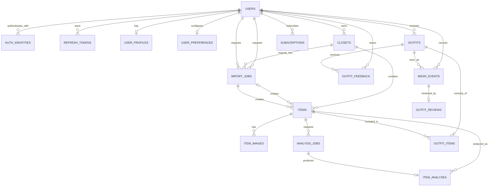
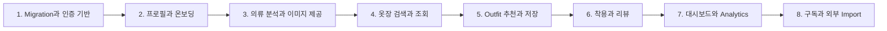
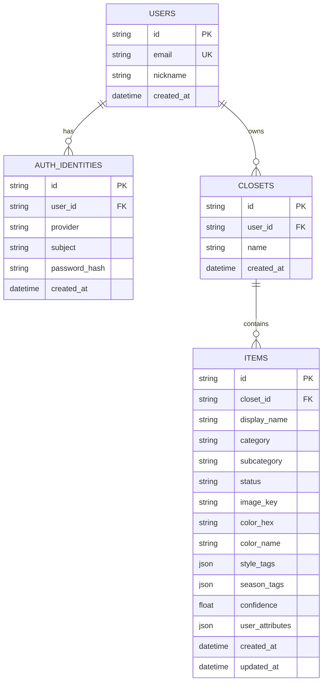

# Wireframe 기준 Backend/API·DB Gap Analysis

> 작성 기준일: 2026-08-04  
> 분석 대상: `wireframe/`의 10개 화면, 현재 `cloth-vision` API 코드, 현재 연동된 `cloth-vision-core`  
> 목적: 지금 구현된 API·DB가 화면을 지원할 수 있는지 판정하고, 화면 구현 전에 필요한 백엔드 작업을 정의한다.

## 0. 가장 먼저 볼 요약 및 필수 내용

### 결론

**현재 API와 DB만으로는 와이어프레임을 충족하지 못한다.**

현재 구현은 다음 범위까지의 초기 MVP이다.

- 이메일 회원가입/로그인과 JWT access token
- 사용자별 옷장 생성 및 목록 조회
- 단일 의류 이미지 업로드와 로컬 파일 저장
- 대표색 1개 추출
- 아이템 목록/상세/수정/삭제
- 한 아이템을 기준으로 다른 아이템과의 1:1 조합 점수 계산

Issue #1에서 와이어프레임 도메인을 담을 17개 SQLAlchemy ORM 테이블과 Alembic
baseline/head migration은 구현했다. 다만 신규 테이블을 사용하는 API와 유스케이스는 아직
구현하지 않았으므로, 아래 화면 충족 판정은 API 실행 기능을 기준으로 유지한다.

반면 와이어프레임의 핵심인 다음 기능은 아직 없다.

- Apple/Google/Kakao 소셜 로그인
- 온보딩 체형·키·성별 정체성·퍼스널 컬러 저장
- 실제 의류 카테고리/소재/스타일/계절 분석 AI
- 배경 제거, 복수 색상 팔레트, 분석 작업 상태/결과 이력
- 검색·필터·정렬·페이지네이션과 표시 가능한 이미지 URL
- 날씨·일정 기반 **다중 아이템 코디** 추천
- 코디 저장, 좋아요/싫어요, 오늘 입기, 착용 이력, 별점 리뷰
- 옷장 점수, 컬러/계절 분포, 미착용 아이템, 착용당 비용 분석
- 프로필/취향/AI 설정/구독 관리

현재 10개 화면 중 백엔드 관점에서 완전히 충족되는 화면은 없다. 로그인, 옷장 채우기, AI 의류 분석 결과, 디지털 옷장, AI 코디 추천, 프로필은 일부 기반만 있고 나머지는 미구현이다.

### 필수 기능 목록

| 우선순위 | 기능명 | 핵심 결과물 |
|---|---|---|
| P0 | 인증 보강 | Apple/Google/Kakao OAuth, refresh/logout, 계정 연결 |
| P0 | 사용자 프로필/온보딩 | 체형·키·성별 정체성·퍼스널 컬러 저장/수정 API |
| P0 | 의류 분석 파이프라인 | 비동기 분석 상태, 실제 Vision provider, 소재·팔레트·태그 결과 |
| P0 | 디지털 옷장 조회 | 이미지 URL, 검색, 카테고리 필터, 정렬, cursor pagination |
| P0 | 코디 모델 | 여러 의류로 구성된 outfit 저장 및 상세 조회 |
| P0 | 코디 추천 | 날씨·일정·날짜·사용자 취향 기반 추천과 점수/이유 |
| P0 | 착용/피드백 | 오늘 입기, 저장, like/dislike, 별점·quick tag·노트 |
| P1 | 홈 대시보드 | 날씨, 오늘 추천, 옷장 점수, 월 착용 수, 최근 추가 아이템 |
| P1 | 옷장 분석 | 컬러/계절 분포, 부족 아이템, 미착용, 착용당 비용 |
| P1 | 프로필 설정 | 프로필 이미지, 지역, 옷장 취향, AI 설정 |
| P2 | 구독 | 플랜/상태/갱신일, 결제 사업자 webhook 및 권한 처리 |
| P2 | 외부 가져오기 | 쇼핑 스크린샷 다중 아이템 추출, OOTD 소스 가져오기 |

### 목표 DB 다이어그램 한눈에 보기



### 구현 순서 한눈에 보기



---

## 1. 분석 범위와 판정 기준

### 검토한 화면

1. 로그인 화면
2. 온보딩: 체형 프로필
3. 홈 대시보드
4. 옷장 채우기
5. AI 의류 분석 결과
6. 디지털 옷장
7. 옷장 분석
8. AI 코디 추천
9. 오늘의 코디 리뷰
10. 프로필

### 판정 기준

- **충족**: 화면의 핵심 데이터를 저장·조회·변경할 API와 영속 모델이 모두 있다.
- **부분 충족**: 일부 원천 데이터나 유사 API는 있지만 화면을 완성할 수 없다.
- **미충족**: 핵심 유스케이스/API/테이블이 없다.
- UI에서만 처리할 수 있는 화면 이동, 로컬 선택 상태, 단순 로그아웃 버튼 표시 등은 백엔드 기능으로 세지 않는다.
- `guide/PROJECT.md`의 미래 설계가 아니라 **실제 실행 코드**를 현재 구현의 기준으로 삼았다.
- 온보딩은 화면에 보이는 체형 프로필 단계만 확정 요구사항으로 본다. 표시된 “5단계”의 나머지 네 단계는 추가 화면이 없으므로 임의로 정의하지 않는다.

---

## 2. 화면별 충족 여부 요약

| 화면 | 상태 | 현재 사용할 수 있는 기반 | 주요 누락 |
|---|---|---|---|
| 로그인 | 부분 충족 | 이메일 회원가입/로그인, access token | Apple/Google/Kakao OAuth, refresh/logout, 계정 연결 |
| 온보딩: 체형 프로필 | 미충족 | 사용자 ID·닉네임 | 성별 정체성, 키, 체형, 퍼스널 컬러 저장/수정 |
| 홈 대시보드 | 미충족 | 최근 아이템 목록을 별도로 조회 가능 | 날씨, 오늘 코디, 월 착용 수, 옷장 점수, 팁 집계 API |
| 옷장 채우기 | 부분 충족 | 단일 이미지 업로드 | 소스 유형, 스크린샷 다중 추출, OOTD import, 비동기 상태 |
| AI 의류 분석 결과 | 부분 충족 | 카테고리, 단일 색상, 스타일/계절 필드 | 실제 AI, 소재/비율, 다색 팔레트, 이미지 URL, 분석 이력 |
| 디지털 옷장 | 부분 충족 | 옷장별 아이템 전체 목록 | 검색, 필터, 정렬, pagination, 썸네일 URL, 총 개수 |
| 옷장 분석 | 미충족 | 아이템의 색상/계절 태그 일부 | 통계 집계, 착용 기록, 가격, 부족/미착용 추천, 리포트 |
| AI 코디 추천 | 부분 충족 | 아이템 2개 간 기본 점수 | 다중 아이템 outfit, 날씨/일정 문맥, 저장/평가/착용 |
| 오늘의 코디 리뷰 | 미충족 | 없음 | 착용 이벤트, 별점, quick tags, 노트, 리뷰 API |
| 프로필 | 부분 충족 | `/auth/me`의 이메일·닉네임 | 프로필 수정/사진/지역, 취향/AI 설정, 구독, 서버 logout |

---

## 3. 현재 구현된 API와 DB

### 3.1 현재 API

Base URL은 `/api/v1`이다.

| Method | Path | 현재 역할 |
|---|---|---|
| GET | `/health` | 서버 상태 조회 |
| POST | `/auth/signup` | 이메일 회원가입, access token 발급 |
| POST | `/auth/login` | 이메일 로그인, access token 발급 |
| GET | `/auth/me` | 현재 사용자 기본 정보 조회 |
| POST | `/closets` | 옷장 생성 |
| GET | `/closets` | 사용자 옷장 목록 |
| POST | `/closets/{closet_id}/items` | 단일 이미지 업로드 후 동기 분석 |
| GET | `/closets/{closet_id}/items` | 아이템 전체 목록 |
| GET | `/items/{item_id}` | 아이템 상세 |
| PATCH | `/items/{item_id}` | 이름/카테고리/하위 카테고리/스타일/계절 수정 |
| DELETE | `/items/{item_id}` | 아이템 및 로컬 원본 이미지 삭제 |
| GET | `/items/{item_id}/recommendations` | 기준 아이템과 다른 아이템의 1:1 조합 점수 |

### 3.2 Alembic baseline과 현재 ORM head

`0001` migration은 Issue #1 이전의 네 테이블을 그대로 캡처한 호환 baseline이다.
기존 데이터베이스를 이 버전으로 식별한 뒤 `0002`로 안전하게 확장한다.



현재 Alembic head와 SQLAlchemy metadata에는 위 네 테이블을 확장한 17개 테이블이
구현되어 있다. 전체 관계와 컬럼·제약·인덱스는 `guide/DATABASE.md`를 기준으로 한다.
ORM이 준비되었다는 사실은 해당 기능의 API까지 구현되었다는 뜻은 아니다.

### 3.3 현재 구현에서 특히 주의할 점

1. `AnalysisPipeline`에는 production Vision provider가 주입되지 않는다. 현재 자동 분석은 전체 이미지의 대표색 1개만 추출한다.
2. 업로드 요청에서 사용자가 `category`를 보내지 않으면 카테고리는 `unknown`, 하위 카테고리는 `unclassified`가 된다.
3. 소재, 패턴, 핏, 복수 팔레트, 배경 제거, segmentation은 구현되지 않았다.
4. 아이템 응답에는 `image_key`나 클라이언트가 접근할 수 있는 image URL이 없다. 따라서 디지털 옷장 카드에 이미지를 표시할 공식 API 계약이 없다.
5. 추천 결과는 DB에 저장되지 않으며 기준 아이템과 후보 아이템 한 벌씩의 pairwise 비교다. 화면처럼 상의·하의·아우터·신발을 묶은 코디가 아니다.
6. 애플리케이션 시작 시 Alembic head까지 upgrade하며 운영에서는 자동 migration을 끌 수 있다. `0001` baseline과 `0002` 확장 migration이 있다.
7. ORM metadata/Alembic 일치, 기존 데이터 보존, upgrade/downgrade는 SQLite와 PostgreSQL에서 검증한다. 화면별 API 유스케이스 테스트는 아직 없다.

---

## 4. 화면별 상세 Gap과 해야 할 작업

### 4.1 로그인 화면

#### 화면 요구사항

- Apple, Google, Kakao 로그인
- 이메일 로그인
- 서비스 약관/개인정보 처리방침 동의

#### 현재 상태

- 이메일/비밀번호 회원가입과 로그인은 가능하다.
- `auth_identities.provider`에 `local`, `google`, `apple` enum은 있으나 실제 OAuth endpoint와 검증 로직은 없다.
- Kakao provider는 enum에도 없다.
- access token만 있고 refresh token, token rotation, 서버 logout/revoke가 없다.

#### 필요한 작업

- `POST /auth/oauth/{provider}/exchange` 추가: 모바일 SDK가 받은 authorization code 또는 provider token을 서버에서 검증한다.
- Apple nonce, Google/Kakao issuer·audience·signature 검증을 구현한다.
- 동일 이메일의 local/social identity 연결 정책을 명시한다. 검증 없이 이메일만 같다는 이유로 자동 연결하면 안 된다.
- refresh token을 해시 형태로 저장하고 rotation/revoke를 지원한다.
- 약관 버전과 동의 시각을 저장할 `user_consents`가 법적 요구사항상 필요할 수 있다. 출시 전 개인정보/법무 정책에 맞춰 확정한다.
- 인증 provider는 `local/apple/google/kakao`를 일관되게 지원한다.

### 4.2 온보딩: 체형 프로필

#### 화면 요구사항

- 성별 정체성 또는 표현 범주
- 키(cm)
- 체형: straight/wave/natural
- 계절별 personal color 선택
- 나중에 프로필에서 수정

#### 현재 상태

- `users`에는 email, nickname만 있다.
- 온보딩 진행 상태나 체형/퍼스널 컬러 데이터가 없다.

#### 필요한 작업

- `user_profiles` 테이블과 조회/수정 API를 추가한다.
- 키 범위, enum 값, nullable 정책을 서버에서 검증한다.
- “유동적” 성별 표현을 단순 male/female enum으로 축소하지 말고 제품에서 사용하는 값과 별도 `self_description` 허용 여부를 확정한다.
- 퍼스널 컬러가 진단 결과인지 사용자 선호 색상인지 의미를 분리한다. 화면 표현대로라면 계절별 컬러 팔레트 선택값으로 우선 저장할 수 있다.
- `onboarding_completed_at` 또는 단계별 완료 상태를 둔다.

권장 API:

```http
GET  /api/v1/profile
PUT  /api/v1/profile/onboarding/body
PATCH /api/v1/profile
```

### 4.3 홈 대시보드

#### 화면 요구사항

- 사용자 이름과 프로필 이미지
- 현재 날씨/기온
- 오늘 추천 코디와 추천 설명
- 옷장 점수
- 이번 달 착용 아이템 수
- AI 스타일리스트 팁
- 최근 추가 아이템

#### 현재 상태

- 사용자 닉네임과 아이템 생성 시각은 조회 가능하다.
- 날씨, 코디, 착용 이력, 옷장 점수, 팁은 없다.
- 화면마다 여러 API를 조합해도 핵심 데이터를 만들 수 없다.

#### 필요한 작업

- 모바일 홈 전용 집계 endpoint를 제공한다.
- 지역/좌표와 사용자의 timezone을 기준으로 날씨 provider를 호출하고 짧게 cache한다.
- 오늘 추천 outfit이 없으면 생성하고, 이미 있으면 같은 결과를 반환하는 idempotency 정책을 둔다.
- 옷장 점수의 계산식을 버전 관리한다. 예: 카테고리 커버리지, 계절 균형, 최근 활용률. 숫자를 AI가 임의 생성하게 해서는 안 된다.
- 스타일 팁은 구조화된 추천 사실을 바탕으로 생성하며, 실패 시 deterministic 문구를 반환한다.

권장 API:

```http
GET /api/v1/dashboard?date=2026-08-04
```

권장 응답 묶음:

- `profile_summary`
- `weather`
- `recommended_outfit`
- `wardrobe_score`
- `monthly_worn_item_count`
- `stylist_tip`
- `recent_items`

### 4.4 옷장 채우기

#### 화면 요구사항

- 직접 촬영
- 쇼핑 스크린샷 업로드
- OOTD 사진/외부 소스에서 가져오기
- 최근 추가 아이템과 AI 스캔 진행 상태

#### 현재 상태

- multipart 단일 이미지 업로드만 가능하다.
- 분석이 요청 안에서 동기 실행되므로 느린 실제 AI provider를 붙이면 timeout 위험이 있다.
- source type, 진행률, 작업 조회, 여러 의류 추출은 없다.

#### 필요한 작업

- 업로드 source를 `camera`, `shopping_screenshot`, `ootd`, `manual`로 구분한다.
- 즉시 `202 Accepted`와 `analysis_job_id`를 반환하고 worker에서 분석하도록 변경한다.
- `GET /analysis-jobs/{id}` 또는 SSE/WebSocket/polling 중 하나로 상태를 제공한다.
- 쇼핑 스크린샷은 상품 영역 탐지와 텍스트/가격/브랜드 추출 범위를 별도 정의한다.
- OOTD 한 장에서 여러 아이템을 만들 경우 사용자가 crop/분리 결과를 확정하는 단계를 둔다.
- 중복 업로드 방지를 위해 원본 hash를 고려한다.

권장 API:

```http
POST /api/v1/closets/{closet_id}/items
POST /api/v1/import-jobs
GET  /api/v1/analysis-jobs/{job_id}
GET  /api/v1/import-jobs/{job_id}
```

### 4.5 AI 의류 분석 결과

#### 화면 요구사항

- 분석 완료 상태와 상품 이미지
- 이름, 컬렉션/브랜드성 보조 정보
- 카테고리, 소재와 비율
- 계절
- 복수 색상 팔레트와 HEX
- 스타일 태그
- 분석값 편집 후 옷장 추가

#### 현재 상태

- category, subcategory, 단일 `color_hex`, `color_name`, style/season tag 필드는 있다.
- 실제 Vision provider가 없어 category/style/season/material 자동 추론은 동작하지 않는다.
- 소재, 혼용률, 다색 팔레트, 이미지 파생본, 분석 모델 버전과 원본 결과가 없다.
- 수정 API는 일부 필드만 수정하며 색상·소재·사용자 확정 상태는 수정할 수 없다.

#### 필요한 작업

- `cloth-vision-core`에 production Vision provider adapter와 엄격한 structured output validation을 구현한다.
- segmentation/background removal과 mask-aware color extraction을 구현한다.
- 소재 혼용률은 이미지 추론만으로 확정값처럼 표시하지 않는다. 라벨 OCR/상품 메타데이터/사용자 입력과 “AI 추정”을 구분한다.
- `item_analyses`에 모델명·버전·pipeline version·confidence·원본 구조화 결과를 저장한다.
- `item_images`에 original/mask/transparent/normalized/thumbnail을 구분해 저장한다.
- 사용자가 수정한 값과 AI 원본을 분리해 provenance를 보존한다.
- 저장소 key를 그대로 노출하지 말고 인증된 image endpoint 또는 짧은 signed URL을 반환한다.

권장 API:

```http
GET   /api/v1/items/{item_id}
PATCH /api/v1/items/{item_id}
POST  /api/v1/items/{item_id}/reanalyze
GET   /api/v1/items/{item_id}/analyses
```

### 4.6 디지털 옷장

#### 화면 요구사항

- 전체 아이템 수
- 전체/상의/하의/아우터 등 카테고리 필터
- 정렬
- 검색
- 썸네일 grid
- 아이템 추가

#### 현재 상태

- 옷장별 전체 아이템 배열은 반환한다.
- category filter, query search, sort, pagination, total count가 없다.
- 응답에 표시 가능한 이미지 URL이 없다.

#### 필요한 작업

- 목록 endpoint에 `category`, `q`, `sort`, `status`, `cursor`, `limit`을 추가한다.
- 응답을 `items`, `next_cursor`, `total_count` 구조로 변경한다.
- `created_at`, category, normalized searchable name에 index를 설계한다.
- signed thumbnail URL 또는 인증 이미지 endpoint를 제공한다.
- 클라이언트가 고정된 한 옷장만 쓴다면 회원가입 시 default closet 자동 생성도 고려한다.

예시:

```http
GET /api/v1/closets/{closet_id}/items?category=outer&q=blazer&sort=recent&limit=30
```

### 4.7 옷장 분석

#### 화면 요구사항

- 가장 많이 입은 컬러 비율
- 계절별 밸런스
- 부족한 필수 아이템 추천과 추가 동작
- 최근 6개월간 잘 입지 않은 옷과 일괄 기부 처리
- 착용당 비용(cost per wear)
- 전체 리포트

#### 현재 상태

- 아이템별 대표색과 계절 태그 일부만 있다.
- “입었다”는 기록, 구매 가격, 기부 상태, 분석 집계 endpoint가 없다.
- 현재 색상은 전체 배경을 포함한 대표색일 수 있어 통계 품질이 충분하지 않다.

#### 필요한 작업

- `wear_events`로 실제 착용 일시와 outfit/items를 기록한다.
- `items`에 `purchase_price`, `currency`, `acquired_at`, `lifecycle_status`, `donated_at` 등을 추가한다.
- `cost_per_wear = purchase_price / wear_count`의 0회 착용 처리와 기간 기준을 정의한다.
- 색상/계절 분포는 DB 집계 또는 analytics read model로 제공한다.
- “부족한 필수 아이템” 규칙은 사용자 프로필, 계절, 보유 카테고리, 코디 커버리지로 deterministic하게 산출하고 설명을 붙인다.
- 기부는 hard delete가 아니라 lifecycle 상태 변경으로 처리한다. 일괄 변경 API는 소유권과 일부 실패 정책을 정의한다.

권장 API:

```http
GET  /api/v1/analytics/wardrobe?period=6m
GET  /api/v1/analytics/wardrobe/report
POST /api/v1/items/bulk-lifecycle
```

### 4.8 AI 코디 추천

#### 화면 요구사항

- 날짜, 날씨, 일정/occasion을 반영한 추천
- 여러 아이템으로 구성된 코디
- 종합 점수와 추천 이유
- 편안함/스타일 등 세부 점수
- 저장/bookmark
- like/dislike
- 오늘 입기
- 스타일리스트 팁

#### 현재 상태

- 단일 기준 아이템과 각 후보 아이템의 color/season/style/category 점수만 계산한다.
- 결과를 저장하지 않고 outfit이라는 도메인도 없다.
- 날씨, 일정, 사용자 선호, 다중 아이템 조합, 편안함, 피드백이 없다.

#### 필요한 작업

- `outfits`와 `outfit_items`를 도입해 2개 이상의 아이템 조합을 영속화한다.
- 추천 요청에 `date`, `occasion`, 선택적 weather/location을 받는다. 서버가 날씨를 조회하는 경우 클라이언트 입력과 혼용 규칙을 정한다.
- 후보 생성 → hard constraint → deterministic scoring → 설명 생성 단계를 분리한다.
- 추천 점수는 모델/규칙 버전과 breakdown을 저장해 재현 가능하게 만든다.
- 품절/기부/삭제/세탁 중 아이템은 추천에서 제외할 수 있도록 item lifecycle/availability를 정의한다.
- bookmark와 like/dislike는 목적이 다르므로 별도 action/feedback으로 저장한다.
- “오늘 입기”는 `wear_event` 생성으로 처리하고 중복 탭에 idempotency key를 사용한다.

권장 API:

```http
POST /api/v1/outfit-recommendations
GET  /api/v1/outfits/{outfit_id}
PUT  /api/v1/outfits/{outfit_id}/bookmark
POST /api/v1/outfits/{outfit_id}/feedback
POST /api/v1/outfits/{outfit_id}/wear
```

### 4.9 오늘의 코디 리뷰

#### 화면 요구사항

- 착용한 코디 표시
- 1~5점 별점
- 편안함/너무 더움/너무 추움/스타일리시함/다시 입고 싶음 quick tags
- 선택적 노트
- 리뷰 제출

#### 현재 상태

- outfit, wear event, review 모두 없다.

#### 필요한 작업

- “추천을 받음”과 “실제로 입음”을 구분하고 리뷰는 `wear_event`에 연결한다.
- 별점은 1~5 정수, 노트 길이, quick tag 허용값을 검증한다.
- 같은 wear event에 대한 리뷰 생성/수정 정책을 정한다. MVP는 1:1 review와 upsert가 단순하다.
- 너무 더움/추움 피드백을 추후 추천에 반영할 수 있도록 당시 weather snapshot을 wear event 또는 outfit에 보존한다.
- 사용자 노트와 피드백은 민감 정보가 될 수 있으므로 로그에 원문을 남기지 않는다.

권장 API:

```http
GET /api/v1/wear-events/{wear_event_id}
PUT /api/v1/wear-events/{wear_event_id}/review
```

### 4.10 프로필

#### 화면 요구사항

- 프로필 사진, 이름, 스타일 메타/지역
- 옷장 취향 설정
- AI 설정
- 옷장 관리
- 구독 관리와 플랜 업그레이드
- 로그아웃

#### 현재 상태

- `/auth/me`는 id, email, nickname, created_at만 반환한다.
- 프로필 수정, 이미지, 지역, 설정, 구독 정보가 없다.
- access token revoke가 없어 서버 관점 logout이 없다.

#### 필요한 작업

- profile 조회/수정과 프로필 이미지 업로드를 추가한다.
- `user_preferences`에 선호/비선호 스타일, 컬러, 핏, AI 설명 강도, 알림 설정 등을 버전 가능한 JSON 또는 명시 컬럼으로 저장한다.
- 구독은 앱스토어/결제 provider를 source of truth로 두고 서버가 webhook 검증 후 entitlement를 반영한다.
- 현재 플랜, 상태, 갱신/만료 시각을 조회하는 API를 제공한다.
- refresh token revoke 기반 logout을 제공한다.

권장 API:

```http
GET   /api/v1/profile
PATCH /api/v1/profile
POST  /api/v1/profile/image
GET   /api/v1/preferences
PATCH /api/v1/preferences
GET   /api/v1/subscription
POST  /api/v1/auth/logout
```

---

## 5. 목표 DB 상세 설계

아래는 와이어프레임을 만족하기 위한 권장 MVP 모델이다. 모든 필드를 처음부터 넣기보다 P0 흐름에 필요한 필드부터 migration으로 추가한다.

### 5.1 핵심 테이블별 역할

#### `users` — 계정의 안정적인 식별자

- 유지: `id`, `email`, `nickname`, `created_at`
- 추가 권장: `status`, `updated_at`, `deleted_at`
- 이메일은 로그인 identity와 연락처 개념이 섞이지 않도록 장기적으로 정리한다.

#### `auth_identities` — 로그인 제공자 연결

- provider: local/apple/google/kakao
- subject: provider가 보장하는 고유 사용자 ID
- local identity만 `password_hash`를 사용한다.
- unique: `(provider, subject)`
- provider access token 원문을 불필요하게 영구 저장하지 않는다.

#### `refresh_tokens` — 로그인 세션

요약 ERD에는 복잡도를 줄이기 위해 생략했지만 운영 인증에는 권장한다.

- `id`, `user_id`, `token_hash`, `device_id`
- `issued_at`, `expires_at`, `revoked_at`, `replaced_by_id`
- token 원문 대신 hash 저장

#### `user_profiles` — 화면에 표시되는 개인 프로필과 온보딩 값

- `user_id` PK/FK
- `display_name`, `profile_image_key`, `location_name`, `timezone`
- `gender_identity`, `height_cm`, `body_type`
- `personal_colors` JSON 또는 별도 정규화 테이블
- `onboarding_completed_at`, `updated_at`

개인정보 최소수집 원칙상 추천에 실제로 쓰지 않을 값은 받지 않는다.

#### `user_preferences` — 취향 및 AI 설정

- `user_id` PK/FK
- `preferred_styles`, `disliked_styles`, `preferred_colors`
- `fit_preferences`, `ai_settings`, `notification_settings`
- `updated_at`

자주 검색/집계하는 값은 명시 컬럼으로, 실험적 설정은 JSON으로 두는 혼합 방식이 적합하다.

#### `closets` — 사용자 소유 옷장

- 현재 구조 유지
- 필요 시 `is_default`, `updated_at`, `archived_at` 추가
- 사용자별 `is_default = true`는 하나만 허용하는 제약을 고려한다.

#### `items` — 사용자가 확정한 현재 의류 상태

- 현재 필드에 `brand`, `collection_name`, `source_type` 추가
- `purchase_price`, `currency`, `acquired_at`
- `lifecycle_status`: active/donated/sold/discarded/archived
- `donated_at`, `last_worn_at`, `wear_count`
- material/color처럼 다중 구조인 값은 분석 결과와 사용자 확정값을 분리한다.
- `wear_count`는 파생값이므로 성능상 캐시한다면 원장인 `wear_events`와 정합성 정책이 필요하다.

#### `item_images` — 원본과 파생 이미지

- `id`, `item_id`, `image_type`, `storage_key`
- `content_type`, `width`, `height`, `byte_size`, `sha256`
- `created_at`
- image type: original/mask/transparent/normalized/thumbnail

#### `analysis_jobs` — 비동기 분석 실행 상태

- `id`, `item_id`, `status`, `attempt`
- `pipeline_version`, `provider`, `error_code`
- `queued_at`, `started_at`, `completed_at`
- 요청 재시도 시 중복 결과를 만들지 않도록 idempotency 정책이 필요하다.

#### `item_analyses` — AI 원본 결과와 provenance

- `id`, `item_id`, `analysis_job_id`
- `model_name`, `model_version`, `pipeline_version`
- `category`, `subcategory`, `materials`, `colors`
- `style_tags`, `season_tags`, `attributes`, `confidence`
- `raw_result`는 개인정보와 provider 약관을 고려해 필요한 경우에만 제한적으로 저장
- `created_at`, `superseded_at`

#### `import_jobs` — 스크린샷/OOTD 가져오기

- `id`, `user_id`, `closet_id`, `source_type`, `source_key`
- `status`, `detected_item_count`, `error_code`
- `created_at`, `completed_at`
- 한 import가 여러 item을 만들 수 있다.

#### `outfits` — 추천 또는 사용자 생성 코디

- `id`, `user_id`, `source`(ai/user), `status`
- `scheduled_for`, `occasion`
- `weather_snapshot`, `overall_score`, `score_breakdown`
- `recommendation_reason`, `stylist_tip`
- `scoring_version`, `is_bookmarked`
- `created_at`, `updated_at`

#### `outfit_items` — 코디와 의류의 다대다 연결

- `outfit_id`, `item_id` 복합 PK 또는 별도 ID
- `role`: top/bottom/outer/shoes/accessory
- `position`, `created_at`
- 한 코디 안에서 동일 item 중복을 막는다.

#### `outfit_feedback` — 추천에 대한 즉시 반응

- `id`, `outfit_id`, `user_id`
- `feedback_type`: like/dislike
- `reason_tags`, `created_at`
- 사용자·outfit별 현재 반응 하나를 허용할지 이벤트 이력으로 둘지 결정한다. MVP는 unique `(user_id, outfit_id)`가 단순하다.

#### `wear_events` — 실제 착용 원장

- `id`, `user_id`, `outfit_id`
- `worn_at`, `weather_snapshot`, `occasion`
- `idempotency_key`, `created_at`
- 옷장 분석의 wear count, last worn, cost per wear는 이 테이블을 기준으로 계산한다.

#### `outfit_reviews` — 착용 후 리뷰

- `id`, `wear_event_id` unique
- `rating` check 1~5
- `quick_tags`, `note`, `created_at`, `updated_at`

#### `subscriptions` — 구독 상태 projection

- `id`, `user_id`, `provider`, `external_subscription_id`
- `plan`, `status`, `current_period_end`
- `cancel_at_period_end`, `updated_at`
- unique `(provider, external_subscription_id)`
- entitlement 판단은 검증된 provider webhook/event를 기준으로 한다.

### 5.2 권장 제약과 인덱스

- 모든 사용자 소유 리소스는 API에서 반드시 소유권을 검증한다.
- FK의 삭제 정책을 명시한다. 분석/착용 통계를 보존해야 하면 item hard delete보다 archive가 적합하다.
- `items(closet_id, created_at desc)`, `items(closet_id, category)`, `wear_events(user_id, worn_at desc)` 인덱스가 필요하다.
- PostgreSQL에서는 UUID, timezone-aware timestamp, JSONB를 사용한다.
- enum은 변경 빈도가 높으면 DB native enum보다 check constraint 또는 lookup 전략을 검토한다.
- 금액은 float가 아니라 `numeric`과 ISO currency code를 사용한다.
- 모든 외부 webhook에는 event ID unique 제약을 두어 중복 처리를 막는다.

---

## 6. 목표 API 목록

아래 목록은 화면 개발에 필요한 계약 초안이다. 경로/필드명은 모바일과 OpenAPI 리뷰 후 확정한다.

### 6.1 인증

| Method | Path | 용도 |
|---|---|---|
| POST | `/auth/signup` | 이메일 회원가입, 현재 API 보강 |
| POST | `/auth/login` | 이메일 로그인, 현재 API 보강 |
| POST | `/auth/oauth/{provider}/exchange` | Apple/Google/Kakao 로그인 |
| POST | `/auth/refresh` | access token 갱신/rotation |
| POST | `/auth/logout` | 현재 refresh session revoke |
| GET | `/auth/me` | 최소 계정 정보 |

### 6.2 프로필과 설정

| Method | Path | 용도 |
|---|---|---|
| GET | `/profile` | 프로필/온보딩 요약 |
| PATCH | `/profile` | 이름, 지역, 체형 등 수정 |
| POST | `/profile/image` | 프로필 이미지 업로드 |
| PUT | `/profile/onboarding/body` | 화면의 체형 프로필 단계 저장 |
| GET | `/preferences` | 옷장 취향/AI 설정 조회 |
| PATCH | `/preferences` | 설정 변경 |
| GET | `/subscription` | 플랜/entitlement 조회 |

### 6.3 옷장과 의류

| Method | Path | 용도 |
|---|---|---|
| POST | `/closets` | 옷장 생성, 현재 API |
| GET | `/closets` | 옷장 목록, 현재 API |
| POST | `/closets/{id}/items` | 원본 업로드 후 비동기 분석 시작 |
| GET | `/closets/{id}/items` | 검색/필터/정렬/pagination 목록 |
| GET | `/items/{id}` | 이미지와 확정 분석을 포함한 상세 |
| PATCH | `/items/{id}` | 사용자가 분석 결과 수정 |
| DELETE | `/items/{id}` | 기본은 archive 권장 |
| POST | `/items/{id}/reanalyze` | 재분석 |
| GET | `/items/{id}/analyses` | 분석 이력 |
| POST | `/items/bulk-lifecycle` | 기부/보관 등 일괄 상태 변경 |
| POST | `/import-jobs` | screenshot/OOTD import |
| GET | `/import-jobs/{id}` | import 상태/결과 |
| GET | `/analysis-jobs/{id}` | AI 분석 상태/오류 |

### 6.4 코디, 착용, 리뷰

| Method | Path | 용도 |
|---|---|---|
| POST | `/outfit-recommendations` | 문맥 기반 다중 아이템 코디 생성 |
| GET | `/outfits/{id}` | 코디 상세 |
| PUT | `/outfits/{id}/bookmark` | 저장/저장 취소 |
| POST | `/outfits/{id}/feedback` | like/dislike |
| POST | `/outfits/{id}/wear` | 오늘 입기/착용 이벤트 생성 |
| GET | `/wear-events/{id}` | 리뷰 화면 데이터 |
| PUT | `/wear-events/{id}/review` | 별점/tag/note upsert |

### 6.5 홈과 분석

| Method | Path | 용도 |
|---|---|---|
| GET | `/dashboard` | 홈 화면용 composite response |
| GET | `/analytics/wardrobe` | 카드별 옷장 분석 데이터 |
| GET | `/analytics/wardrobe/report` | 전체 리포트 |

---

## 7. 구현 계획과 우선순위

### Phase 0 — 계약 확정

- 각 와이어프레임의 interaction과 loading/empty/error 상태를 정의한다.
- 나머지 온보딩 4단계 화면과 데이터 요구사항을 추가로 확정한다.
- API naming, enum, 시간대, 통화, 삭제/기부 정책을 모바일 팀과 합의한다.
- OpenAPI 예시와 mock response를 먼저 만들어 프론트 개발을 분리한다.

### Phase 1 — 데이터와 인증 기반(P0)

- [x] Alembic 도입, 기존 4개 테이블 baseline migration 생성
- [x] `user_profiles`, `user_preferences`, `refresh_tokens` ORM과 migration 추가
- [ ] 프로필/온보딩/refresh token API와 유스케이스 연결
- OAuth provider 3종 중 출시 우선 provider부터 구현
- refresh rotation, logout/revoke, 인증/인가 테스트

완료 조건:

- 신규/기존 DB에서 migration upgrade/downgrade가 검증된다.
- 이메일 및 선택한 social provider의 가입/로그인/재로그인이 통합 테스트를 통과한다.
- 온보딩 값을 저장하고 다시 조회했을 때 동일한 값을 얻는다.

### Phase 2 — 의류 수집과 분석(P0)

- [x] `item_images`, `analysis_jobs`, `item_analyses`, `import_jobs` ORM과 migration 추가
- [ ] 신규 모델을 repository/API/worker 흐름에 연결
- object storage 또는 안전한 로컬 개발 storage adapter와 signed/read endpoint 구현
- worker/queue와 retry/timeout/error 상태 구현
- Core에 segmentation 및 production Vision provider 연결
- category/material/colors/style/season structured result 검증
- 사용자 보정과 AI 원본 분리

완료 조건:

- camera 이미지 업로드가 timeout 없이 job ID를 반환한다.
- 성공/실패/재시도 상태가 API로 관찰된다.
- 분석 결과 화면의 모든 확정 필드와 이미지를 표시·수정할 수 있다.
- background가 있는 표준 fixture에서 의류 중심 색상 품질 기준을 통과한다.

### Phase 3 — 디지털 옷장(P0)

- filter/search/sort/cursor pagination
- thumbnail 제공과 cache policy
- default closet 및 empty state 정책
- 목록 쿼리 성능 테스트

완료 조건:

- 카테고리 필터와 정렬이 안정적으로 동작한다.
- 중간에 item이 추가돼도 cursor pagination에서 심각한 중복/누락이 없다.
- 목록 카드에 표시 가능한 thumbnail URL과 total count가 포함된다.

### Phase 4 — 코디와 피드백(P0)

- [x] `outfits`, `outfit_items`, `outfit_feedback`, `wear_events`, `outfit_reviews` ORM과 migration 추가
- [ ] 신규 모델을 repository/API/추천 흐름에 연결
- 다중 item 후보 생성/제약/점수 알고리즘 구현
- 날씨와 occasion context 연결
- bookmark, feedback, wear, review API 구현
- 점수/설명 버전과 추천 재현성 테스트

완료 조건:

- 하나의 추천에 역할별 여러 item이 포함된다.
- 추천 이유와 score breakdown이 구조화되어 반환된다.
- “오늘 입기” 후 리뷰가 저장되고 wear count 분석에 반영된다.
- dislike된 특성이 후속 추천에 어떻게 반영되는지 규칙이 명시된다.

### Phase 5 — 홈과 옷장 분석(P1)

- dashboard composite endpoint
- wardrobe analytics query/read model
- 컬러/계절 분포, 미착용, cost per wear 계산
- 부족 아이템 추천 규칙과 전체 리포트
- 기부 bulk transition

완료 조건:

- 동일 원천 데이터로 dashboard와 analytics 값이 일관된다.
- 기간/timezone 경계 테스트가 통과한다.
- 추천/점수의 계산 근거와 버전을 추적할 수 있다.

### Phase 6 — 구독과 고급 import(P2)

- [x] `subscriptions`, `import_jobs` ORM과 migration 추가
- [ ] 신규 모델을 결제/import 유스케이스에 연결
- 결제 provider 결정과 webhook 검증
- subscription projection/entitlement
- screenshot 다중 아이템 분리
- OOTD import의 지원 소스/저작권/개인정보 정책 확정

---

## 8. API 외에 반드시 필요한 작업

### DB migration과 운영 안정성

- [x] 실행 코드의 `Base.metadata.create_all()`을 Alembic migration으로 교체했다.
- [x] 기존 데이터 backfill, nullable → not null 전환, index 생성 순서를 `0002`에 포함했다.
- [x] SQLite/PostgreSQL에서 metadata 일치와 upgrade/downgrade를 교차 검증한다.
- [ ] 운영 배포에서는 애플리케이션 기동과 migration 실행 권한을 분리한다.

### AI/Core 작업

- 현재 Core는 production vision, segmentation, material/pattern/fit 분석이 없다.
- provider 호출은 timeout, 제한된 retry, rate limit, circuit breaking 또는 실패 격리를 적용한다.
- AI 결과를 신뢰하기 전에 schema와 허용 enum, confidence 범위를 검증한다.
- authoritative score는 deterministic code가 계산하고 LLM은 설명 문장 생성에만 사용한다.
- pipeline/model/scoring 버전을 DB에 저장한다.
- 소재 혼용률처럼 이미지로 확정하기 어려운 값은 “추정”임을 API와 UI에서 드러낸다.

### 이미지 저장과 보안

- production에서 로컬 디스크만 사용하면 수평 확장과 재배포에 취약하다. object storage adapter를 권장한다.
- 원본은 비공개로 두고 signed URL 또는 소유권 검증 endpoint로 제공한다.
- MIME만 신뢰하지 말고 실제 decode, 크기, pixel count, 확장자, 악성 payload를 검증한다.
- EXIF 위치정보 제거 정책과 원본 보존 정책을 정한다.
- 계정 삭제 시 이미지/분석/리뷰 삭제 또는 익명화 정책을 마련한다.

### 외부 연동

- 날씨 provider 실패/지연 시 fallback 응답을 정의한다.
- OAuth 및 결제 webhook signature를 검증하고 replay를 차단한다.
- 모바일이 전송한 위치를 장기 저장할 필요가 없다면 최소화하고, 저장 시 동의/보존 기간을 정한다.

### 테스트

- 화면별 happy path뿐 아니라 빈 옷장, 분석 실패, provider timeout, 삭제된 item, 만료 token을 테스트한다.
- repository contract test로 SQLite/PostgreSQL 동작 차이를 줄인다.
- 추천 알고리즘은 fixture 기반 회귀 테스트와 속성 기반 invariant 테스트를 둔다.
- analytics는 timezone, 월 경계, 0회 착용, 가격 없음, 기부 상태를 테스트한다.
- API 응답 snapshot 또는 OpenAPI contract test를 모바일 mock과 연결한다.

### 관측성

- request ID, user-safe error code, analysis job ID를 로그와 응답에 연결한다.
- OAuth/AI/weather/payment provider별 latency와 error rate를 수집한다.
- 이미지, token, 사용자 노트, provider credential을 로그에 남기지 않는다.

---

## 9. 제품 결정이 필요한 항목

개발 전에 아래 질문은 반드시 확정해야 한다.

1. 온보딩 5단계 중 나머지 4단계에서 어떤 값을 수집하는가?
2. “퍼스널 컬러”는 진단 결과인가, 사용자 선호 팔레트인가?
3. OOTD 가져오기는 휴대폰 사진 선택인가, 특정 외부 서비스 연동인가?
4. 쇼핑 스크린샷에서 한 상품만 등록하는가, 여러 상품을 자동 분리하는가?
5. 소재 비율은 AI 추정, 케어라벨 OCR, 상품 정보, 사용자 입력 중 무엇을 우선하는가?
6. 오늘 추천 코디는 반드시 사용자가 보유한 item으로만 구성되는가?
7. 캘린더 일정은 사용자가 직접 occasion을 고르는가, 캘린더 권한으로 읽는가?
8. 옷장 점수의 정의와 0~100 계산식은 무엇인가?
9. “잘 입지 않는 옷”의 기준은 6개월 0회인가, 사용자의 계절/보유기간을 보정하는가?
10. “전체 기부하기”는 앱 내 상태 변경만 하는가, 외부 기부 서비스까지 연결하는가?
11. 구독의 무료/프리미엄 entitlement와 제한량은 무엇인가?
12. 사용자 탈퇴 시 분석 이미지, 착용 기록, 리뷰의 보존/삭제 정책은 무엇인가?

---

## 10. 최종 권고

와이어프레임을 기준으로 보면 지금 단계에서 기존 API에 endpoint 몇 개만 덧붙이는 방식은 적합하지 않다. 먼저 다음 세 축을 안정적으로 완성해야 한다.

1. **사용자 축**: social auth → profile/onboarding → preference/subscription
2. **의류 축**: upload/import → async analysis → confirmed item → searchable closet
3. **코디 축**: outfit recommendation → bookmark/feedback → wear event → review → analytics

가장 먼저 구현할 실제 사용자 흐름은 아래가 적절하다.

```text
로그인
→ 체형 프로필 저장
→ default closet 생성
→ 사진 1장 업로드
→ 분석 완료 확인 및 사용자 보정
→ 옷장 목록에서 조회
→ 보유 의류 기반 다중 아이템 코디 추천
→ 오늘 입기
→ 리뷰 저장
→ 홈/옷장 분석에 착용 데이터 반영
```

이 vertical slice가 통합 테스트로 끝까지 통과한 뒤 screenshot/OOTD import, 정교한 통계, 구독을 추가하는 것이 리스크가 가장 낮다.

---

## 11. 분석 근거 파일

- 와이어프레임: `wireframe/*.png`
- 현재 API 목록: `src/cloth_vision_api/adapters/inbound/api/routers/`
- 현재 요청/응답 스키마: `src/cloth_vision_api/adapters/inbound/api/schemas.py`
- 현재 ORM 모델: `src/cloth_vision_api/adapters/outbound/database/orm/`
- 현재 DB repository: `src/cloth_vision_api/adapters/outbound/database/repository.py`
- 현재 유스케이스: `src/cloth_vision_api/application/use_cases.py`
- 현재 애플리케이션 조립: `src/cloth_vision_api/main.py`
- 현재 Core 분석/추천: `../cloth-vision-core/src/cloth_vision_core/`
- 기존 미래 설계 참고: `guide/PROJECT.md`
