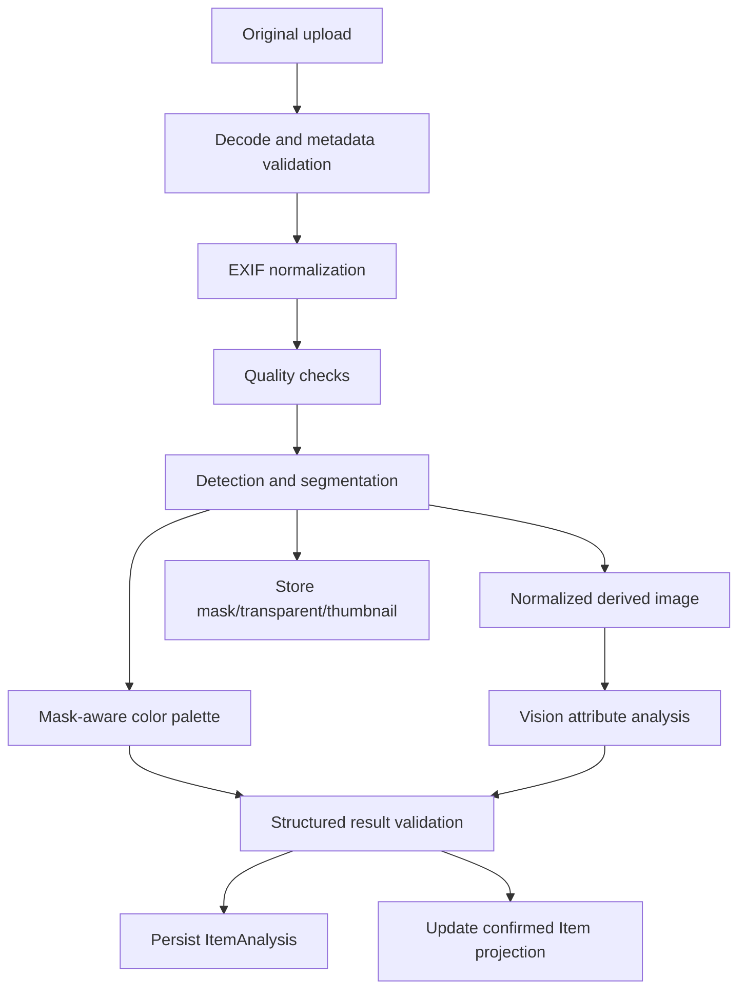

# 의류 AI 분석 Pipeline

## 1. 목표 화면

이 pipeline은 다음 화면을 직접 지원한다.

- 옷장 채우기: 업로드와 분석 진행 상태
- AI 의류 분석 결과: 이미지, category, 소재, 계절, 팔레트, style tags
- 디지털 옷장: thumbnail과 검색 가능한 확정 속성
- 옷장 분석/코디 추천: 신뢰할 수 있는 색상·계절·스타일 입력

## 2. 현재 구현

현재 `cloth-vision-core`는 다음을 제공한다.

- Pillow 기반 JPEG/PNG/WebP decode
- 손상/최소 해상도 검사
- EXIF orientation 보정
- 전체 이미지의 대표색 1개와 단순 색상명
- optional Vision provider protocol
- provider가 없을 때 `unknown/unclassified` fallback

현재 API는 Vision provider를 주입하지 않으므로 category/style/season/material 자동 분석은
실제로 동작하지 않는다. segmentation, 배경 제거, mask 기반 색상, production provider,
embedding도 아직 없다.

## 3. 목표 흐름



## 4. 단계별 요구사항

### 4.1 수신과 검증

- 허용 MIME: JPEG/PNG/WebP
- MIME header와 실제 decode 결과를 함께 검증
- 최대 byte size와 최대 pixel count 제한
- 최소 해상도 검증
- 애니메이션/다중 frame 처리 정책
- EXIF orientation 적용 후 위치 metadata 제거 정책
- SHA-256으로 중복/재시도 식별 보조

검증 실패는 재시도해도 성공하지 않으므로 terminal user error로 분류한다.

### 4.2 화질 검사

MVP 후보:

- blur/focus
- 너무 어둡거나 밝은 노출
- 의류 잘림
- 복수 의류 또는 의류 없음

화질 점수는 허위 정밀도를 피한다. hard reject와 warning을 구분하고, warning 이미지는
사용자가 계속 진행할 수 있는 정책을 검토한다.

### 4.3 Detection과 Segmentation

출력:

- bounding box
- binary/alpha mask
- detected item count
- segmentation confidence

한 장에 여러 의류가 검출되면 camera 단일 등록과 OOTD/import 흐름을 구분한다.

- camera: 대표 의류 선택 또는 사용자 선택 요구
- screenshot/OOTD: crop 후보를 만들고 사용자가 확정한 뒤 item 생성

### 4.4 정규화와 파생 이미지

원본을 생성형으로 다시 그리지 않는다.

파생 artifact:

- `original`: 사용자 업로드
- `mask`: 의류 영역
- `transparent`: alpha 배경
- `normalized`: 비율 유지, 중앙 정렬
- `thumbnail`: 목록 최적화

로고, 패턴, 단추와 실루엣이 원본과 달라질 수 있는 generative transformation은 MVP에서
사용하지 않는다.

### 4.5 색상 팔레트

전체 이미지가 아니라 의류 mask 안의 픽셀만 사용한다.

권장 단계:

```text
sRGB normalization
→ 선택적 white balance
→ mask 적용
→ LAB/LCh 변환
→ 그림자/하이라이트 outlier 완화
→ clustering
→ 비율이 있는 대표색 추출
```

출력 예시:

```json
{
  "colors": [
    {
      "display_hex": "#8B948E",
      "color_name": "sage_green",
      "ratio": 0.62,
      "lab": [60.1, -5.4, 3.2],
      "confidence": 0.88
    }
  ]
}
```

### 4.6 Vision 속성 분석

최소 출력:

- category/subcategory
- style tags
- season tags
- pattern/fit 등 선택 속성
- material 후보와 confidence
- 전체/provider confidence

소재 혼용률은 일반 사진만으로 확정하기 어렵다. 다음 provenance를 구분한다.

- `vision_estimate`
- `label_ocr`
- `shopping_metadata`
- `user_confirmed`

AI 추정을 제품 라벨의 확정 혼용률처럼 표시하지 않는다.

## 5. 구조화 결과 계약

```json
{
  "schema_version": "1.0",
  "category": "outer",
  "subcategory": "blazer",
  "materials": [
    {"name": "linen", "ratio": null, "source": "vision_estimate", "confidence": 0.76}
  ],
  "colors": [],
  "style_tags": ["professional", "minimal"],
  "season_tags": ["spring", "summer"],
  "attributes": {"pattern": "solid", "fit": "regular"},
  "confidence": 0.84
}
```

검증 규칙:

- 알 수 없는 값은 임의로 가장 가까운 enum에 넣지 않고 `unknown` 처리
- confidence는 0~1
- 비율이 있으면 각 값은 0~1, 합계 허용 오차 정의
- tag 개수와 문자열 길이 제한
- provider 설명 문장을 authoritative field로 사용하지 않음

## 6. Job과 재시도

```text
queued → running → succeeded
                 ↘ failed
```

오류 분류:

| 유형 | 예 | 재시도 |
|---|---|---|
| user input | 손상 이미지, 너무 작은 이미지 | 안 함 |
| provider transient | timeout, 429, 5xx | 제한적으로 수행 |
| provider permanent | unsupported request, invalid credential | 안 함/운영 경보 |
| internal | schema bug, storage failure | 정책에 따라 수행 |

새 retry attempt는 provider, 모델, 시작/완료 시각과 error code를 기록한다.

## 7. Item 확정값과 AI 원본

```text
ItemAnalysis (immutable AI result)
        ↓ initial projection
FashionItem (user-facing confirmed fields)
        ↑ user correction
```

사용자 보정 후 재분석하더라도 확정값을 자동 덮어쓰지 않는다. 새 분석 결과와 기존
사용자 값을 비교해 선택적으로 적용한다.

## 8. 품질 평가

Golden fixture set:

- category별 대표 의류
- 밝고 어두운 배경
- 복잡한 배경과 그림자
- 무채색/다색/패턴
- 한 장에 여러 아이템
- 저해상도, blur, crop
- 피부나 사람을 포함한 착용 사진

측정 항목:

- validation precision/recall
- segmentation IoU 또는 mask 품질
- category accuracy와 confusion matrix
- palette Delta E와 dominant color 순위
- schema validation failure rate
- provider latency/cost
- 사용자 수정률

provider 변경은 동일 fixture에서 회귀 평가한 뒤 적용한다.

## 9. 책임 경계

Core:

- image processor와 pipeline
- provider protocol
- result model/validation
- mask 기반 색상 알고리즘

API/Worker:

- upload 인증과 저장
- job 생성/재시도
- provider credential/configuration
- DB 영속화와 사용자 projection
- artifact URL 제공
