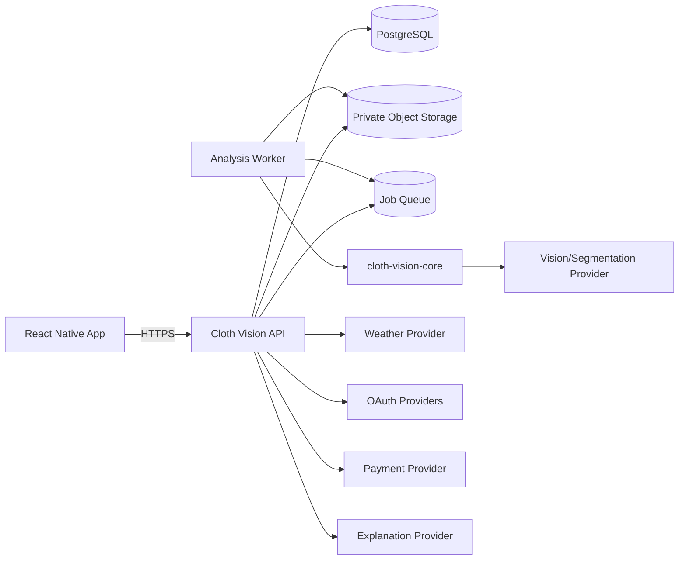
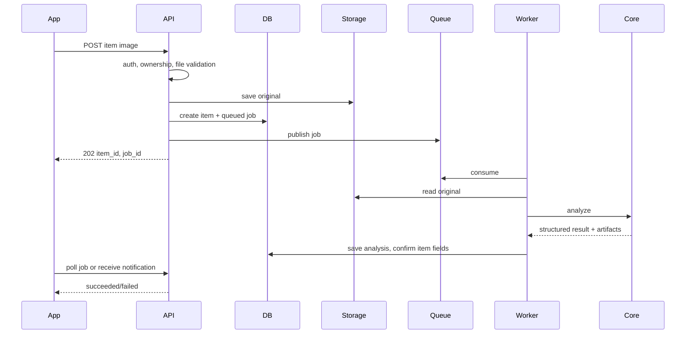
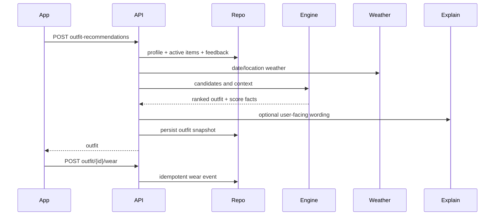

# 시스템 아키텍처

## 1. System Context



현재 로컬 구현은 queue/object storage 대신 요청 내 동기 분석과 로컬 파일 저장을 사용한다.
목표 구조는 실제 Vision 처리 전에 worker 경계를 도입한다.

## 2. 저장소 경계

### `cloth-vision-core`

- 이미지 검증, EXIF 보정, 정규화
- provider-neutral Vision/segmentation/explanation protocol
- 구조화된 분석 결과
- deterministic matching/scoring
- 외부 provider의 optional adapter

금지:

- FastAPI, SQLAlchemy, JWT
- 사용자/옷장/outfit CRUD
- 환경변수와 배포 설정
- 업로드 파일 영속화

### `cloth-vision`

- HTTP schema와 router
- 인증/인가와 사용자 소유권
- application use case와 transaction
- PostgreSQL repository와 migration
- image storage, queue, weather/OAuth/payment adapter
- Core 조립과 job orchestration

## 3. 내부 계층

```text
adapters/inbound
    FastAPI router, worker consumer
            ↓
application
    use case, transaction, orchestration
            ↓
domain + ports
    entity, policy, outbound protocol
            ↑
adapters/outbound
    PostgreSQL, storage, provider, JWT
```

의존성은 adapter에서 application/domain 방향이다. domain은 FastAPI, SQLAlchemy와 provider
SDK를 import하지 않는다.

## 4. 화면별 Read/Write 경계

| 화면 | Write | Read |
|---|---|---|
| 로그인 | identity/session 생성 | 현재 사용자 |
| 온보딩 | profile/preferences upsert | onboarding 상태 |
| 홈 | 필요 시 오늘 outfit 생성 | dashboard composite |
| 옷장 채우기 | item/image/job 생성 | job 상태와 최근 item |
| 분석 결과 | item 사용자 확정값 수정 | image와 latest analysis |
| 디지털 옷장 | lifecycle 변경 | 검색·필터 목록 |
| 코디 추천 | outfit과 feedback/wear 생성 | outfit 상세 |
| 코디 리뷰 | review upsert | wear event 상세 |
| 옷장 분석 | bulk lifecycle 변경 | analytics read model |
| 프로필 | profile/settings/subscription action | profile projection |

## 5. 핵심 흐름

### 의류 업로드와 분석



DB commit과 queue publish 사이 정합성은 outbox pattern 또는 동등한 보장으로 해결한다.
초기 단계에서는 DB job polling worker도 허용한다.

### 코디 추천과 착용



## 6. 동기와 비동기 기준

동기:

- auth/profile CRUD
- closet/item list/detail
- bookmark/feedback/review
- 이미 계산된 dashboard/analytics 조회

비동기:

- Vision/segmentation/embedding
- screenshot/OOTD 다중 분석
- 큰 analytics materialization
- 알림과 외부 webhook 후속 처리

요청 시간이 provider 성능에 종속되거나 retry가 필요하면 worker 경계를 사용한다.

## 7. 데이터 일관성

- 한 use case의 DB write는 transaction으로 묶는다.
- object 저장 후 DB 실패 시 orphan cleanup을 수행한다.
- job과 webhook은 idempotency key/event ID를 가진다.
- AI 결과 저장 후 item projection 갱신은 같은 transaction 또는 재시도 가능한 단계로 처리한다.
- dashboard cache는 원천 데이터보다 authoritative하지 않다.

## 8. 외부 Provider 경계

각 provider adapter는 다음 공통 정책을 가진다.

- timeout
- 제한된 retry와 backoff
- typed error
- rate-limit 인식
- provider request ID 기록
- credential/원문 이미지 로그 금지
- local fake/mock 구현

## 9. 단계적 전환

1. Alembic과 domain schema를 먼저 도입한다.
2. 현재 local storage를 `ImageStorage` port 뒤에서 유지하며 image table을 추가한다.
3. DB polling 기반 analysis worker로 HTTP 요청과 AI 실행을 분리한다.
4. 운영 시 object storage와 queue adapter로 교체한다.
5. dashboard/analytics는 데이터가 쌓인 뒤 read model을 추가한다.

이 순서는 초기 개발 환경을 과도하게 복잡하게 만들지 않으면서 화면의 비동기 상태 계약을
먼저 안정화한다.
