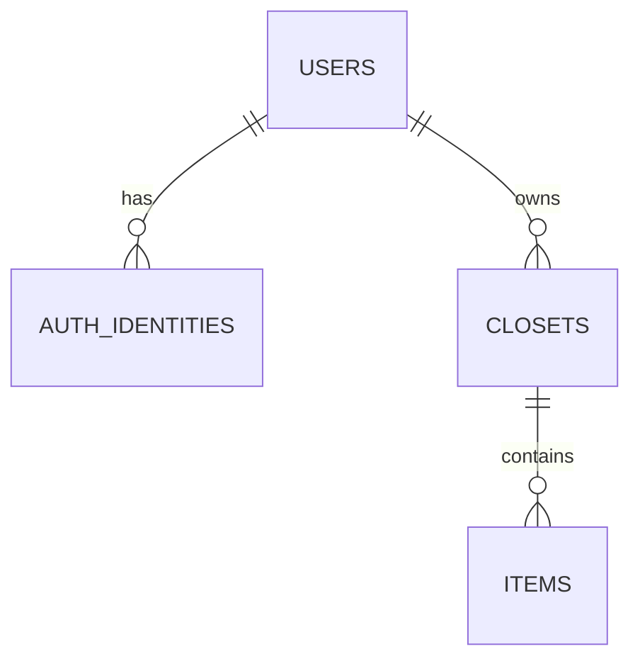
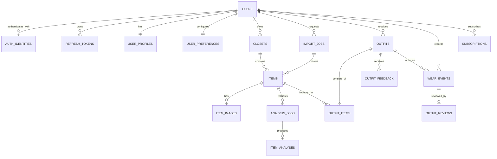

# 데이터베이스 설계

## 1. 원칙

- 운영 기준은 PostgreSQL이며 UUID와 timezone-aware timestamp를 사용한다.
- 사용자 확정 데이터, AI 원본, 실행 job을 분리한다.
- 실제 착용의 원장은 `wear_events`다.
- 삭제/기부/판매는 통계와 복구 요구를 고려해 lifecycle로 표현한다.
- schema 변경은 `create_all()`이 아니라 Alembic migration으로 관리한다.
- JSONB는 구조가 유동적인 결과에 사용하고, 검색·제약이 중요한 값은 컬럼으로 둔다.

## 2. 현재 실제 스키마

| 테이블 | 현재 역할 | 주요 한계 |
|---|---|---|
| `users` | email/nickname 계정 | profile/onboarding/settings 없음 |
| `auth_identities` | local identity와 password hash | OAuth/session 없음 |
| `closets` | 사용자 옷장 | default/archive 정책 없음 |
| `items` | 이미지 key와 분석/표시 값을 한 행에 저장 | AI 원본/파생 이미지/착용 lifecycle 분리 안 됨 |

`guide/PROJECT.md`의 과거 ERD에 있던 일부 테이블은 실제 코드에 구현되지 않았으므로 현재
스키마로 간주하지 않는다.

## 3. 목표 스키마

## 4. 테이블 정의

### Identity와 Profile

#### `users`

- `id uuid PK`
- `email varchar(320) UNIQUE`
- `nickname varchar(80)`
- `status varchar(20)`
- `created_at`, `updated_at`, `deleted_at`

#### `auth_identities`

- `id uuid PK`, `user_id FK`
- `provider`: local/apple/google/kakao
- `subject`, `password_hash nullable`
- unique `(provider, subject)`

#### `refresh_tokens`

- `id uuid PK`, `user_id FK`
- `token_hash`, `device_id`
- `issued_at`, `expires_at`, `revoked_at`, `replaced_by_id`
- 원문 refresh token은 저장하지 않는다.

#### `user_profiles`

- `user_id PK/FK`
- `display_name`, `profile_image_key`
- `location_name`, `timezone`
- `gender_identity`, `height_cm`, `body_type`
- `personal_colors jsonb`
- `onboarding_completed_at`, `updated_at`

#### `user_preferences`

- `user_id PK/FK`
- `preferred_styles`, `disliked_styles`, `preferred_colors`
- `fit_preferences`, `ai_settings`, `notification_settings`
- `updated_at`

### Wardrobe와 Analysis

#### `closets`

- 현재 컬럼 유지
- `is_default`, `archived_at`, `updated_at` 추가 고려
- 사용자별 default closet 하나를 보장한다.

#### `items`

- identity: `id`, `closet_id`
- 표시값: `display_name`, `brand`, `collection_name`
- 확정 분석값: `category`, `subcategory`, `materials`, `colors`, `style_tags`, `season_tags`
- 수집 정보: `source_type`, `purchase_price numeric`, `currency`, `acquired_at`
- 상태: `analysis_status`, `lifecycle_status`, `donated_at`
- cache: `last_worn_at`, `wear_count`
- audit: `created_at`, `updated_at`

`materials`와 `colors`를 JSONB로 시작할 수 있지만 검색 요구가 커지면 child table로
정규화한다.

#### `item_images`

- `id`, `item_id`, `image_type`, `storage_key`
- `content_type`, `width`, `height`, `byte_size`, `sha256`
- `created_at`
- image type: original/mask/transparent/normalized/thumbnail

#### `analysis_jobs`

- `id`, `item_id`, `status`, `attempt`
- `provider`, `pipeline_version`, `error_code`
- `queued_at`, `started_at`, `completed_at`
- retry는 기존 행을 덮기보다 attempt를 추적한다.

#### `item_analyses`

- `id`, `item_id`, `analysis_job_id UNIQUE`
- `model_name`, `model_version`, `pipeline_version`
- `category`, `subcategory`, `materials`, `colors`
- `style_tags`, `season_tags`, `attributes`, `confidence`
- `raw_result`, `created_at`, `superseded_at`

#### `import_jobs`

- `id`, `user_id`, `closet_id`, `source_type`, `source_key`
- `status`, `detected_item_count`, `error_code`
- `created_at`, `completed_at`

### Outfit, Wear와 Analytics

#### `outfits`

- `id`, `user_id`, `source`, `status`
- `scheduled_for`, `occasion`
- `weather_snapshot`, `preference_snapshot`
- `overall_score`, `score_breakdown`
- `recommendation_reason`, `stylist_tip`, `scoring_version`
- `is_bookmarked`, `created_at`, `updated_at`

#### `outfit_items`

- `outfit_id`, `item_id`, `role`, `position`, `created_at`
- unique `(outfit_id, item_id)`

#### `outfit_feedback`

- `id`, `outfit_id`, `user_id`, `feedback_type`
- `reason_tags`, `created_at`, `updated_at`
- MVP에서는 unique `(user_id, outfit_id)`

#### `wear_events`

- `id`, `user_id`, `outfit_id`
- `worn_at`, `weather_snapshot`, `occasion`
- `idempotency_key`, `created_at`
- unique `(user_id, idempotency_key)`

#### `outfit_reviews`

- `id`, `wear_event_id UNIQUE`
- `rating` check 1~5
- `quick_tags`, `note`, `created_at`, `updated_at`

#### `subscriptions`

- `id`, `user_id`, `provider`, `external_subscription_id`
- `plan`, `status`, `current_period_end`, `cancel_at_period_end`
- unique `(provider, external_subscription_id)`

## 5. 인덱스

- `items(closet_id, created_at desc)`
- `items(closet_id, category, created_at desc)`
- 검색 방식 확정 후 normalized display name의 trigram 또는 full-text index
- `analysis_jobs(status, queued_at)`
- `outfits(user_id, scheduled_for desc)`
- `wear_events(user_id, worn_at desc)`
- `item_analyses(item_id, created_at desc)`

## 6. 삭제 정책

- User 탈퇴: 법적/운영 정책에 따라 개인 데이터 삭제 또는 익명화
- Item 제거: 기본은 `archived`; 명시적 영구 삭제는 image artifact와 파생 데이터 처리
- Closet 삭제: active item이 있으면 거부하거나 명시적 cascade 확인
- Outfit/Wear: 과거 analytics 보존 필요 시 item 표시 snapshot 또는 tombstone 사용
- Analysis raw result: 보존 기간을 두고 주기적으로 삭제 가능

## 7. Migration 순서

1. Alembic baseline으로 현재 4개 테이블을 캡처한다.
2. profile/preferences/refresh session을 추가한다.
3. item image/job/analysis 테이블을 추가하고 기존 `items.image_key`를 backfill한다.
4. item의 분석 상태와 lifecycle 상태를 분리한다.
5. outfit/wear/review를 추가한다.
6. analytics용 index와 필요한 cache 컬럼을 추가한다.
7. subscription/import는 해당 기능 착수 시 추가한다.

각 migration은 빈 DB와 기존 데이터 DB 모두에서 upgrade를 검증한다. 운영 데이터가 있는
컬럼은 nullable 추가 → backfill → constraint 강화 순서를 사용한다.
