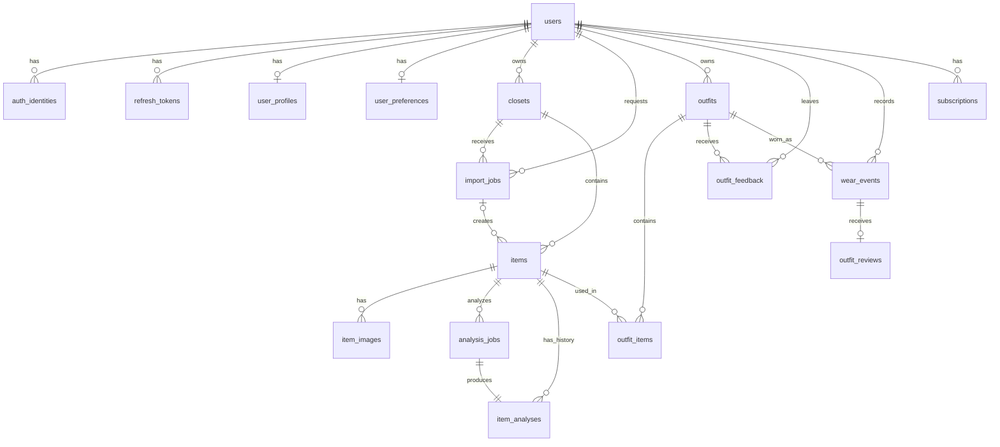

# 데이터베이스 테이블 및 컬럼 사전

## 1. 문서 목적

이 문서는 `cloth-vision` API에서 사용하는 SQLAlchemy ORM 스키마를 기준으로 각 테이블의 역할과 컬럼 의미를 설명한다. 신규 API 개발, Alembic 마이그레이션 작성, 데이터 조회 및 장애 분석 시 공통 참고 자료로 사용한다.

현재 스키마는 총 17개 테이블이며 다음 세 영역으로 구분된다.

| 영역 | 테이블 | 주요 역할 |
| --- | --- | --- |
| 사용자 및 인증 | `users`, `auth_identities`, `refresh_tokens`, `user_profiles`, `user_preferences` | 계정, 로그인 수단, 세션, 프로필 및 개인화 설정 |
| 옷장 및 분석 | `closets`, `import_jobs`, `items`, `item_images`, `analysis_jobs`, `item_analyses` | 옷장, 의류 등록, 이미지, AI 분석 실행 및 결과 |
| 코디 및 서비스 | `outfits`, `outfit_items`, `outfit_feedback`, `wear_events`, `outfit_reviews`, `subscriptions` | 코디 추천, 피드백, 착용 기록, 후기 및 구독 |

## 2. 공통 표기 기준

- `String(36)` 식별자는 애플리케이션에서 UUID 문자열로 생성한다.
- 날짜·시간 컬럼은 별도 표기가 없으면 타임존을 포함하는 `DateTime(timezone=True)`이다.
- JSON 컬럼은 PostgreSQL에서는 `JSONB`, SQLite 등 그 외 DB에서는 일반 `JSON` 타입을 사용한다.
- **필수**는 `NULL`을 허용하지 않는 컬럼, **선택**은 `NULL`을 허용하는 컬럼을 의미한다.
- 기본값은 SQLAlchemy ORM 모델의 계약을 기준으로 기재했다. DB 서버 기본값이 없는 경우 ORM을 거치지 않은 직접 INSERT에서는 값을 명시해야 할 수 있다.
- 외래 키 삭제 정책은 `CASCADE`(부모 삭제 시 함께 삭제), `SET NULL`(참조만 해제), `RESTRICT`(참조 중이면 부모 삭제 제한)로 표시한다.
- `created_at`, `updated_at` 등의 시간은 특별한 언급이 없으면 현재 시각을 기본값으로 사용한다.

---

## 3. 사용자 및 인증

### 3.1 `users` — 사용자 계정

서비스 사용자의 최상위 계정 엔티티다. 인증 수단, 프로필, 개인화 설정, 옷장, 코디 및 구독 데이터가 이 테이블의 사용자를 기준으로 연결된다. 탈퇴 이력을 보존할 수 있도록 `deleted_at`을 이용한 소프트 삭제를 지원한다.

- 이메일은 전체 사용자 중 중복될 수 없다.
- 상태는 `active`, `disabled`, `deleted` 중 하나다.
- 사용자 삭제 시 직접 연결된 인증·설정·옷장 등의 데이터는 관계별 외래 키 정책에 따라 함께 정리된다.

| 컬럼 | 타입 | 필수 여부 | 키/기본값 | 설명 |
| --- | --- | --- | --- | --- |
| `id` | `String(36)` | 필수 | PK | 사용자 UUID 문자열 |
| `email` | `String(320)` | 필수 | UNIQUE, INDEX | 로그인 및 연락에 사용하는 이메일 주소 |
| `nickname` | `String(80)` | 필수 | - | 서비스에서 표시할 사용자 닉네임 |
| `status` | `String(20)` | 필수 | 기본값 `active` | 계정 상태. `active`, `disabled`, `deleted`만 허용 |
| `created_at` | `DateTime` | 필수 | 기본값 현재 시각 | 계정 생성 시각 |
| `updated_at` | `DateTime` | 필수 | 생성·수정 시 현재 시각 | 계정 정보의 마지막 수정 시각 |
| `deleted_at` | `DateTime` | 선택 | 기본값 `NULL` | 소프트 삭제 처리 시각. 값이 없으면 삭제되지 않은 계정 |

### 3.2 `auth_identities` — 로그인 인증 수단

한 사용자가 보유한 로컬 계정 또는 소셜 로그인 식별자를 저장한다. 사용자 계정과 인증 제공자를 분리하여 동일 사용자가 여러 로그인 수단을 연결할 수 있도록 한다.

- `(provider, subject)` 조합은 유일하다.
- 제공자는 `local`, `apple`, `google`, `kakao` 중 하나다.
- 사용자 삭제 시 해당 사용자의 인증 수단도 삭제된다(`CASCADE`).
- 소셜 로그인은 비밀번호를 사용하지 않으므로 `password_hash`가 없을 수 있다.

| 컬럼 | 타입 | 필수 여부 | 키/기본값 | 설명 |
| --- | --- | --- | --- | --- |
| `id` | `String(36)` | 필수 | PK | 인증 수단 UUID 문자열 |
| `user_id` | `String(36)` | 필수 | FK → `users.id`, INDEX, CASCADE | 인증 수단을 소유한 사용자 |
| `provider` | `String(30)` | 필수 | 복합 UNIQUE, INDEX | 인증 제공자. 로컬 또는 지원하는 소셜 로그인 종류 |
| `subject` | `String(320)` | 필수 | 복합 UNIQUE | 제공자 내부에서 사용자를 식별하는 값. 로컬 인증에서는 이메일 등의 고유 식별자 |
| `password_hash` | `String(255)` | 선택 | 기본값 `NULL` | 로컬 로그인 비밀번호의 해시. 원문 비밀번호는 저장하지 않음 |
| `created_at` | `DateTime` | 필수 | 기본값 현재 시각 | 인증 수단 등록 시각 |

### 3.3 `refresh_tokens` — 리프레시 토큰 세션

로그인 세션을 갱신하기 위한 리프레시 토큰의 해시와 수명 주기를 관리한다. 토큰 원문 대신 해시만 저장하며, 토큰 교체 관계를 기록하여 로테이션과 재사용 탐지를 지원한다.

- `token_hash`는 전체 토큰 중 유일하다.
- 사용자 삭제 시 모든 리프레시 토큰도 삭제된다(`CASCADE`).
- 토큰 교체 시 이전 행의 `replaced_by_id`가 새 토큰을 가리킨다.
- 교체된 토큰이 삭제되면 이전 토큰의 참조는 `NULL`이 된다(`SET NULL`).

| 컬럼 | 타입 | 필수 여부 | 키/기본값 | 설명 |
| --- | --- | --- | --- | --- |
| `id` | `String(36)` | 필수 | PK | 리프레시 토큰 레코드 UUID 문자열 |
| `user_id` | `String(36)` | 필수 | FK → `users.id`, INDEX, CASCADE | 토큰이 발급된 사용자 |
| `token_hash` | `String(255)` | 필수 | UNIQUE | 리프레시 토큰 원문의 단방향 해시 |
| `device_id` | `String(120)` | 선택 | 기본값 `NULL` | 토큰이 발급된 기기 또는 클라이언트 식별자 |
| `issued_at` | `DateTime` | 필수 | 기본값 현재 시각 | 토큰 발급 시각 |
| `expires_at` | `DateTime` | 필수 | - | 토큰 만료 시각 |
| `revoked_at` | `DateTime` | 선택 | 기본값 `NULL` | 로그아웃, 탈취 대응 등으로 토큰을 폐기한 시각 |
| `replaced_by_id` | `String(36)` | 선택 | SELF FK → `refresh_tokens.id`, SET NULL | 토큰 로테이션으로 새로 발급된 후속 토큰 |

### 3.4 `user_profiles` — 사용자 프로필

계정 자체와 분리된 사용자 표시 정보 및 신체·퍼스널 컬러 정보를 저장한다. 사용자당 최대 한 행만 존재하는 1:0..1 관계이며, 온보딩과 향후 코디 개인화의 입력으로 사용한다.

- `user_id`가 PK이자 FK이므로 사용자별 프로필은 하나만 존재한다.
- 사용자 삭제 시 프로필도 삭제된다(`CASCADE`).
- 키·체형·퍼스널 컬러와 같은 민감하거나 선택적인 정보는 사용자가 제공한 경우에만 저장한다.

| 컬럼 | 타입 | 필수 여부 | 키/기본값 | 설명 |
| --- | --- | --- | --- | --- |
| `user_id` | `String(36)` | 필수 | PK, FK → `users.id`, CASCADE | 프로필 소유 사용자 |
| `display_name` | `String(80)` | 선택 | 기본값 `NULL` | 프로필 화면에 표시할 이름 |
| `profile_image_key` | `String(255)` | 선택 | 기본값 `NULL` | 오브젝트 스토리지의 프로필 이미지 키 |
| `location_name` | `String(120)` | 선택 | 기본값 `NULL` | 날씨 기반 추천 등에 사용할 사용자 지역명 |
| `timezone` | `String(64)` | 필수 | 기본값 `UTC` | 사용자 기준 타임존 식별자 |
| `gender_identity` | `String(40)` | 선택 | 기본값 `NULL` | 사용자가 선택적으로 입력한 성별 정체성 |
| `height_cm` | `Integer` | 선택 | 80~250 | 사용자 키(cm). 허용 범위를 벗어난 값은 저장 불가 |
| `body_type` | `String(30)` | 선택 | 기본값 `NULL` | 체형 분류. `straight`, `wave`, `natural`만 허용 |
| `personal_colors` | `JSONB` | 필수 | 기본값 `{}` | 퍼스널 컬러 시즌, 톤 등 구조화된 분석 또는 사용자 입력 |
| `onboarding_completed_at` | `DateTime` | 선택 | 기본값 `NULL` | 필수 온보딩 절차를 완료한 시각 |
| `updated_at` | `DateTime` | 필수 | 생성·수정 시 현재 시각 | 프로필 마지막 수정 시각 |

### 3.5 `user_preferences` — 사용자 개인화 설정

스타일, 색상, 핏, AI 추천 및 알림과 관련된 사용자 선호를 저장한다. 자주 확장될 수 있는 설정을 JSON 구조로 보관하여 스키마 변경 없이 세부 옵션을 추가할 수 있도록 한다.

- `user_id`가 PK이자 FK이므로 사용자별 설정은 하나만 존재한다.
- 사용자 삭제 시 설정도 삭제된다(`CASCADE`).
- JSON 내부 구조는 API 요청·응답 스키마에서 별도로 검증해야 한다.

| 컬럼 | 타입 | 필수 여부 | 키/기본값 | 설명 |
| --- | --- | --- | --- | --- |
| `user_id` | `String(36)` | 필수 | PK, FK → `users.id`, CASCADE | 설정 소유 사용자 |
| `preferred_styles` | `JSONB` | 필수 | 기본값 `[]` | 선호하는 스타일 태그 목록 |
| `disliked_styles` | `JSONB` | 필수 | 기본값 `[]` | 기피하는 스타일 태그 목록 |
| `preferred_colors` | `JSONB` | 필수 | 기본값 `[]` | 선호 색상 코드 또는 명칭 목록 |
| `fit_preferences` | `JSONB` | 필수 | 기본값 `{}` | 상·하의 등 카테고리별 핏 선호 설정 |
| `ai_settings` | `JSONB` | 필수 | 기본값 `{}` | AI 추천 강도, 실험 기능 등 개인화 관련 설정 |
| `notification_settings` | `JSONB` | 필수 | 기본값 `{}` | 푸시 및 서비스 알림 수신 설정 |
| `updated_at` | `DateTime` | 필수 | 생성·수정 시 현재 시각 | 설정 마지막 수정 시각 |

---

## 4. 옷장 및 AI 분석

### 4.1 `closets` — 사용자 옷장

사용자가 의류를 분류해 보관하는 논리적 컨테이너다. 기본 옷장 외에도 목적별 옷장을 추가할 수 있으며, 삭제 대신 보관 처리할 수 있다.

- 사용자 삭제 시 옷장도 삭제된다(`CASCADE`).
- 부분 유니크 인덱스로 사용자당 `is_default = true`인 옷장은 최대 하나만 허용한다.
- `archived_at`이 있으면 현재 사용하지 않는 보관된 옷장으로 해석한다.

| 컬럼 | 타입 | 필수 여부 | 키/기본값 | 설명 |
| --- | --- | --- | --- | --- |
| `id` | `String(36)` | 필수 | PK | 옷장 UUID 문자열 |
| `user_id` | `String(36)` | 필수 | FK → `users.id`, INDEX, CASCADE | 옷장 소유 사용자 |
| `name` | `String(80)` | 필수 | - | 사용자에게 표시할 옷장 이름 |
| `is_default` | `Boolean` | 필수 | 기본값 `false` | 사용자의 기본 옷장 여부 |
| `created_at` | `DateTime` | 필수 | 기본값 현재 시각 | 옷장 생성 시각 |
| `updated_at` | `DateTime` | 필수 | 생성·수정 시 현재 시각 | 옷장 마지막 수정 시각 |
| `archived_at` | `DateTime` | 선택 | 기본값 `NULL` | 옷장을 보관 처리한 시각 |

### 4.2 `import_jobs` — 의류 일괄 가져오기 작업

쇼핑 화면 캡처 또는 OOTD 이미지에서 여러 의류를 감지하고 옷장에 등록하는 비동기 작업을 관리한다. 작업 상태, 입력 이미지, 감지 결과 수 및 오류 정보를 기록한다.

- 사용자 또는 대상 옷장 삭제 시 가져오기 작업도 삭제된다(`CASCADE`).
- 입력 유형은 `shopping_screenshot`, `ootd` 중 하나다.
- 상태는 `queued`, `running`, `succeeded`, `failed`, `cancelled` 중 하나다.
- 한 작업에서 감지된 여러 의류가 `items.import_job_id`로 이 행을 참조할 수 있다.

| 컬럼 | 타입 | 필수 여부 | 키/기본값 | 설명 |
| --- | --- | --- | --- | --- |
| `id` | `String(36)` | 필수 | PK | 가져오기 작업 UUID 문자열 |
| `user_id` | `String(36)` | 필수 | FK → `users.id`, INDEX, CASCADE | 작업을 요청한 사용자 |
| `closet_id` | `String(36)` | 필수 | FK → `closets.id`, INDEX, CASCADE | 감지된 의류를 추가할 대상 옷장 |
| `source_type` | `String(30)` | 필수 | - | 입력 이미지 유형. 쇼핑 캡처 또는 OOTD |
| `source_key` | `String(255)` | 필수 | - | 오브젝트 스토리지에 저장된 원본 입력 파일 키 |
| `status` | `String(30)` | 필수 | 기본값 `queued`, INDEX | 비동기 가져오기 작업의 현재 상태 |
| `detected_item_count` | `Integer` | 필수 | 기본값 `0`, 0 이상 | 작업에서 감지된 의류 개수 |
| `error_code` | `String(80)` | 선택 | 기본값 `NULL` | 실패 원인을 분류하기 위한 기계 판독용 오류 코드 |
| `created_at` | `DateTime` | 필수 | 기본값 현재 시각 | 작업 생성 시각 |
| `completed_at` | `DateTime` | 선택 | 기본값 `NULL` | 작업이 성공·실패·취소로 종료된 시각 |

### 4.3 `items` — 옷장 의류

사용자의 옷장에 등록되어 화면과 비즈니스 로직에서 사용하는 의류의 기준 데이터다. AI 분석값을 그대로 보관하는 테이블이 아니라, 사용자가 확인하거나 수정한 최종 표시값과 사용 이력을 담는 현재 상태 프로젝션이다.

- 옷장 삭제 시 소속 의류도 삭제된다(`CASCADE`).
- 가져오기 작업이 삭제되더라도 의류는 유지되고 `import_job_id`만 `NULL`이 된다(`SET NULL`).
- 분석 상태는 `processing`, `ready`, `failed`, 생명 주기 상태는 `active`, `archived`, `donated`, `sold`, `discarded` 중 하나다.
- 등록 출처는 `camera`, `manual`, `shopping_screenshot`, `ootd` 중 하나다.
- 옷장·생성 시각 및 옷장·카테고리·생성 시각 조합에 조회용 인덱스가 있다.

| 컬럼 | 타입 | 필수 여부 | 키/기본값 | 설명 |
| --- | --- | --- | --- | --- |
| `id` | `String(36)` | 필수 | PK | 의류 UUID 문자열 |
| `closet_id` | `String(36)` | 필수 | FK → `closets.id`, INDEX, CASCADE | 의류가 속한 옷장 |
| `import_job_id` | `String(36)` | 선택 | FK → `import_jobs.id`, INDEX, SET NULL | 일괄 가져오기로 생성된 경우 원본 작업 |
| `display_name` | `String(120)` | 필수 | - | 목록과 상세 화면에 표시할 의류 이름 |
| `brand` | `String(120)` | 선택 | 기본값 `NULL` | 의류 브랜드명 |
| `collection_name` | `String(120)` | 선택 | 기본값 `NULL` | 제품 컬렉션 또는 라인 이름 |
| `category` | `String(30)` | 필수 | INDEX | 상의, 하의, 아우터 등 상위 카테고리 |
| `subcategory` | `String(60)` | 선택 | 기본값 `NULL` | 셔츠, 데님 팬츠 등 세부 카테고리 |
| `analysis_status` | `String(30)` | 필수 | 기본값 `processing`, INDEX | 의류 AI 분석의 현재 상태 |
| `lifecycle_status` | `String(30)` | 필수 | 기본값 `active`, INDEX | 보유·보관·기부·판매·폐기 등 의류 생명 주기 상태 |
| `source_type` | `String(30)` | 필수 | 기본값 `manual` | 의류가 등록된 입력 경로 |
| `image_key` | `String(255)` | 선택 | 기본값 `NULL` | 대표 이미지 스토리지 키. 세부 이미지 테이블과의 호환용 필드 |
| `color_hex` | `String(7)` | 선택 | 기본값 `NULL` | 대표 색상의 `#RRGGBB` 형식 값 |
| `color_name` | `String(50)` | 선택 | 기본값 `NULL` | 대표 색상의 사용자 친화적 명칭 |
| `colors` | `JSONB` | 필수 | 기본값 `[]` | 복수 색상 및 색상별 비율·신뢰도 등의 구조화 목록 |
| `materials` | `JSONB` | 필수 | 기본값 `[]` | 소재명, 혼용률 등의 구조화 목록 |
| `style_tags` | `JSONB` | 필수 | 기본값 `[]` | 캐주얼, 미니멀 등 스타일 태그 목록 |
| `season_tags` | `JSONB` | 필수 | 기본값 `[]` | 봄, 여름, 가을, 겨울 등 적합 계절 태그 목록 |
| `confidence` | `Float` | 선택 | 기본값 `NULL` | 현재 표시되는 AI 분석 결과의 대표 신뢰도 |
| `user_attributes` | `JSONB` | 필수 | 기본값 `{}` | 사용자가 직접 추가하거나 수정한 확장 속성 |
| `purchase_price` | `Numeric(12,2)` | 선택 | 0 이상 | 구매 가격. 통화는 `currency`와 함께 해석 |
| `currency` | `String(3)` | 선택 | 기본값 `NULL` | ISO 4217 형식의 통화 코드(예: `KRW`, `USD`) |
| `acquired_at` | `Date` | 선택 | 기본값 `NULL` | 구매 또는 증여 등으로 의류를 취득한 날짜 |
| `donated_at` | `DateTime` | 선택 | 기본값 `NULL` | 의류를 기부 처리한 시각 |
| `last_worn_at` | `DateTime` | 선택 | 기본값 `NULL` | 마지막으로 착용한 시각. 착용 이벤트 기반 요약값 |
| `wear_count` | `Integer` | 필수 | 기본값 `0`, 0 이상 | 누적 착용 횟수. 착용 이벤트 기반 요약값 |
| `created_at` | `DateTime` | 필수 | 기본값 현재 시각 | 의류 등록 시각 |
| `updated_at` | `DateTime` | 필수 | 생성·수정 시 현재 시각 | 의류 정보 마지막 수정 시각 |

### 4.4 `item_images` — 의류 이미지 메타데이터

의류별 원본 이미지와 마스크, 누끼, 정규화 이미지, 썸네일 등 파생 이미지의 메타데이터를 저장한다. 실제 이미지 바이너리는 DB가 아닌 오브젝트 스토리지에 두고 이 테이블에는 스토리지 키와 파일 속성만 보관한다.

- 의류 삭제 시 관련 이미지 메타데이터도 삭제된다(`CASCADE`).
- 이미지 유형은 `original`, `mask`, `transparent`, `normalized`, `thumbnail` 중 하나다.
- `(item_id, image_type)` 조합은 유일하여 의류별 이미지 유형당 한 행만 허용한다.
- `storage_key`는 전체 이미지 중 유일하다.

| 컬럼 | 타입 | 필수 여부 | 키/기본값 | 설명 |
| --- | --- | --- | --- | --- |
| `id` | `String(36)` | 필수 | PK | 이미지 메타데이터 UUID 문자열 |
| `item_id` | `String(36)` | 필수 | FK → `items.id`, INDEX, CASCADE | 이미지가 속한 의류 |
| `image_type` | `String(30)` | 필수 | 복합 UNIQUE | 원본·마스크·누끼·정규화·썸네일 구분 |
| `storage_key` | `String(255)` | 필수 | UNIQUE | 오브젝트 스토리지 내 파일 식별 키 |
| `content_type` | `String(80)` | 필수 | - | 이미지 MIME 타입(예: `image/jpeg`, `image/png`) |
| `width` | `Integer` | 필수 | 0 초과 | 이미지 가로 픽셀 수 |
| `height` | `Integer` | 필수 | 0 초과 | 이미지 세로 픽셀 수 |
| `byte_size` | `Integer` | 필수 | 0 초과 | 이미지 파일 크기(byte) |
| `sha256` | `String(64)` | 필수 | INDEX | 무결성 확인 및 중복 탐지용 SHA-256 해시 |
| `created_at` | `DateTime` | 필수 | 기본값 현재 시각 | 이미지 메타데이터 생성 시각 |

### 4.5 `analysis_jobs` — 의류 AI 분석 작업

의류 한 건에 대한 AI 분석 실행 단위와 재시도 이력을 관리한다. 큐 대기, 실행, 성공·실패 상태와 사용한 파이프라인, 오류 정보를 기록하여 비동기 처리와 운영 관측성을 확보한다.

- 의류 삭제 시 모든 분석 작업도 삭제된다(`CASCADE`).
- 상태는 `queued`, `running`, `succeeded`, `failed`, `cancelled` 중 하나다.
- `(item_id, attempt)` 조합은 유일하여 같은 의류의 재시도 번호가 중복될 수 없다.
- `(status, queued_at)` 인덱스는 워커가 처리 대상을 조회할 때 사용한다.

| 컬럼 | 타입 | 필수 여부 | 키/기본값 | 설명 |
| --- | --- | --- | --- | --- |
| `id` | `String(36)` | 필수 | PK | 분석 작업 UUID 문자열 |
| `item_id` | `String(36)` | 필수 | FK → `items.id`, INDEX, CASCADE | 분석 대상 의류 |
| `status` | `String(30)` | 필수 | 기본값 `queued` | 분석 작업의 현재 처리 상태 |
| `attempt` | `Integer` | 필수 | 기본값 `1`, 0 초과 | 동일 의류 분석의 시도 순번 |
| `provider` | `String(80)` | 선택 | 기본값 `NULL` | 분석을 수행한 외부 제공자 또는 내부 실행기 명칭 |
| `pipeline_version` | `String(40)` | 필수 | - | 전처리부터 후처리까지 적용한 분석 파이프라인 버전 |
| `error_code` | `String(80)` | 선택 | 기본값 `NULL` | 실패 원인을 분류하는 기계 판독용 오류 코드 |
| `error_detail` | `Text` | 선택 | 기본값 `NULL` | 운영 및 디버깅을 위한 상세 오류 정보 |
| `queued_at` | `DateTime` | 필수 | 기본값 현재 시각 | 작업이 큐에 등록된 시각 |
| `started_at` | `DateTime` | 선택 | 기본값 `NULL` | 워커가 분석을 시작한 시각 |
| `completed_at` | `DateTime` | 선택 | 기본값 `NULL` | 분석 작업이 종료된 시각 |

### 4.6 `item_analyses` — 의류 AI 분석 결과

AI가 생성한 의류 분석 결과와 모델·파이프라인 출처를 보존한다. 사용자가 수정할 수 있는 `items`의 현재 표시값과 분리하여 결과 재현, 모델 비교, 재분석 및 감사가 가능하도록 한다.

- 의류 삭제 시 분석 결과도 삭제된다(`CASCADE`).
- 분석 작업과 결과는 1:1이며 `analysis_job_id`는 유일하다.
- `(item_id, created_at)` 인덱스로 의류별 분석 이력을 시간순 조회한다.
- 새 분석으로 대체된 과거 결과는 `superseded_at`으로 표시할 수 있다.

| 컬럼 | 타입 | 필수 여부 | 키/기본값 | 설명 |
| --- | --- | --- | --- | --- |
| `id` | `String(36)` | 필수 | PK | 분석 결과 UUID 문자열 |
| `item_id` | `String(36)` | 필수 | FK → `items.id`, INDEX, CASCADE | 분석 대상 의류 |
| `analysis_job_id` | `String(36)` | 필수 | FK → `analysis_jobs.id`, UNIQUE, CASCADE | 이 결과를 생성한 분석 작업 |
| `model_name` | `String(80)` | 필수 | - | 분석에 사용한 모델 이름 |
| `model_version` | `String(80)` | 필수 | - | 분석 모델 버전 또는 배포 식별자 |
| `pipeline_version` | `String(40)` | 필수 | - | 결과를 생성한 전체 분석 파이프라인 버전 |
| `category` | `String(30)` | 필수 | - | AI가 판단한 상위 의류 카테고리 |
| `subcategory` | `String(60)` | 선택 | 기본값 `NULL` | AI가 판단한 세부 카테고리 |
| `materials` | `JSONB` | 필수 | 기본값 `[]` | AI가 감지한 소재와 신뢰도 등의 목록 |
| `colors` | `JSONB` | 필수 | 기본값 `[]` | AI가 감지한 색상과 비율·신뢰도 등의 목록 |
| `style_tags` | `JSONB` | 필수 | 기본값 `[]` | AI가 분류한 스타일 태그 목록 |
| `season_tags` | `JSONB` | 필수 | 기본값 `[]` | AI가 추정한 적합 계절 태그 목록 |
| `attributes` | `JSONB` | 필수 | 기본값 `{}` | 패턴, 소매, 핏 등 모델별 확장 분석 속성 |
| `confidence` | `Float` | 선택 | 0~1 | 분석 결과의 대표 신뢰도 |
| `raw_result` | `JSONB` | 필수 | 기본값 `{}` | 추적과 재처리를 위한 모델 원본 응답 |
| `created_at` | `DateTime` | 필수 | 기본값 현재 시각 | 분석 결과 생성 시각 |
| `superseded_at` | `DateTime` | 선택 | 기본값 `NULL` | 더 최신 결과로 대체되어 현행 결과가 아니게 된 시각 |

---

## 5. 코디, 착용 및 구독

### 5.1 `outfits` — 코디

여러 의류를 묶은 코디 추천 또는 사용자가 직접 구성한 코디를 저장한다. 추천 당시의 날씨·선호 설정과 점수, 설명을 스냅샷으로 보존하여 이후 설정이나 알고리즘이 바뀌어도 당시 결과를 재현할 수 있게 한다.

- 사용자 삭제 시 코디도 삭제된다(`CASCADE`).
- 생성 출처는 `ai`, `user`, 상태는 `draft`, `recommended`, `accepted`, `archived` 중 하나다.
- `(user_id, scheduled_for)` 인덱스로 사용자별 날짜 코디를 조회한다.
- 코디와 의류의 다대다 관계는 `outfit_items`가 담당한다.

| 컬럼 | 타입 | 필수 여부 | 키/기본값 | 설명 |
| --- | --- | --- | --- | --- |
| `id` | `String(36)` | 필수 | PK | 코디 UUID 문자열 |
| `user_id` | `String(36)` | 필수 | FK → `users.id`, INDEX, CASCADE | 코디 소유 사용자 |
| `source` | `String(20)` | 필수 | 기본값 `ai` | AI 추천 또는 사용자 직접 생성 여부 |
| `status` | `String(30)` | 필수 | 기본값 `recommended` | 코디 작성·추천·수락·보관 상태 |
| `scheduled_for` | `Date` | 선택 | 기본값 `NULL` | 코디를 착용하도록 추천하거나 계획한 날짜 |
| `occasion` | `String(80)` | 선택 | 기본값 `NULL` | 출근, 데이트, 여행 등 코디 목적 |
| `weather_snapshot` | `JSONB` | 필수 | 기본값 `{}` | 추천 시점의 기온, 강수, 날씨 등 입력값 |
| `preference_snapshot` | `JSONB` | 필수 | 기본값 `{}` | 추천 시점에 적용한 사용자 선호 설정 |
| `overall_score` | `Integer` | 선택 | 0~100 | 코디 전체 적합도 점수 |
| `score_breakdown` | `JSONB` | 필수 | 기본값 `{}` | 색상, 날씨, 스타일 등 항목별 점수와 근거 |
| `recommendation_reasons` | `JSONB` | 필수 | 기본값 `[]` | 사용자에게 표시할 추천 이유 목록 |
| `stylist_tip` | `Text` | 선택 | 기본값 `NULL` | 착용법이나 액세서리 등에 관한 스타일링 팁 |
| `scoring_version` | `String(40)` | 필수 | - | 코디 점수를 계산한 규칙 또는 모델 버전 |
| `is_bookmarked` | `Boolean` | 필수 | 기본값 `false` | 사용자의 코디 북마크 여부 |
| `created_at` | `DateTime` | 필수 | 기본값 현재 시각 | 코디 생성 시각 |
| `updated_at` | `DateTime` | 필수 | 생성·수정 시 현재 시각 | 코디 마지막 수정 시각 |

### 5.2 `outfit_items` — 코디 구성 의류

코디와 의류의 다대다 관계를 표현하며 각 의류가 코디에서 맡는 역할과 표시 순서를 저장한다. 두 외래 키를 복합 기본 키로 사용하므로 같은 의류를 한 코디에 중복 추가할 수 없다.

- 코디 삭제 시 구성 관계도 삭제된다(`CASCADE`).
- 의류가 코디에 사용 중이면 의류 삭제가 제한된다(`RESTRICT`).
- 역할은 `top`, `bottom`, `outer`, `shoes`, `accessory` 중 하나다.

| 컬럼 | 타입 | 필수 여부 | 키/기본값 | 설명 |
| --- | --- | --- | --- | --- |
| `outfit_id` | `String(36)` | 필수 | 복합 PK, FK → `outfits.id`, CASCADE | 구성 의류가 속한 코디 |
| `item_id` | `String(36)` | 필수 | 복합 PK, FK → `items.id`, RESTRICT | 코디에 포함된 의류 |
| `role` | `String(30)` | 필수 | - | 코디 안에서 의류가 담당하는 상의·하의 등의 역할 |
| `position` | `Integer` | 필수 | 기본값 `0`, 0 이상 | 같은 코디 내 표시 또는 조합 순서 |
| `created_at` | `DateTime` | 필수 | 기본값 현재 시각 | 코디에 의류를 추가한 시각 |

### 5.3 `outfit_feedback` — 코디 추천 피드백

사용자가 코디 추천에 남긴 좋아요·싫어요와 사유 태그를 저장한다. 추천 품질 평가와 개인화 학습의 입력으로 사용한다.

- `(user_id, outfit_id)` 조합은 유일하여 사용자별 코디당 하나의 최신 피드백만 유지한다.
- 코디 또는 사용자가 삭제되면 피드백도 삭제된다(`CASCADE`).
- 피드백 유형은 `like`, `dislike` 중 하나다.

| 컬럼 | 타입 | 필수 여부 | 키/기본값 | 설명 |
| --- | --- | --- | --- | --- |
| `id` | `String(36)` | 필수 | PK | 피드백 UUID 문자열 |
| `outfit_id` | `String(36)` | 필수 | FK → `outfits.id`, INDEX, CASCADE | 평가 대상 코디 |
| `user_id` | `String(36)` | 필수 | FK → `users.id`, INDEX, CASCADE | 피드백을 남긴 사용자 |
| `feedback_type` | `String(20)` | 필수 | - | 좋아요 또는 싫어요 구분 |
| `reason_tags` | `JSONB` | 필수 | 기본값 `[]` | 색 조합, 날씨, 취향 등 선택형 평가 사유 태그 |
| `created_at` | `DateTime` | 필수 | 기본값 현재 시각 | 최초 피드백 생성 시각 |
| `updated_at` | `DateTime` | 필수 | 생성·수정 시 현재 시각 | 피드백 마지막 변경 시각 |

### 5.4 `wear_events` — 코디 착용 이벤트

사용자가 특정 코디를 실제로 착용한 사실을 기록하는 원장성 이벤트 테이블이다. 의류별 착용 횟수와 마지막 착용 시각을 계산하거나 갱신하는 기준 데이터로 사용한다.

- 사용자 삭제 시 착용 이벤트도 삭제된다(`CASCADE`).
- 착용 기록이 존재하는 코디는 삭제가 제한된다(`RESTRICT`).
- `(user_id, idempotency_key)` 조합은 유일하여 클라이언트 재시도로 인한 중복 기록을 방지한다.
- `(user_id, worn_at)` 인덱스로 사용자 착용 이력을 시간순 조회한다.

| 컬럼 | 타입 | 필수 여부 | 키/기본값 | 설명 |
| --- | --- | --- | --- | --- |
| `id` | `String(36)` | 필수 | PK | 착용 이벤트 UUID 문자열 |
| `user_id` | `String(36)` | 필수 | FK → `users.id`, INDEX, CASCADE | 코디를 착용한 사용자 |
| `outfit_id` | `String(36)` | 필수 | FK → `outfits.id`, INDEX, RESTRICT | 실제 착용한 코디 |
| `worn_at` | `DateTime` | 필수 | 기본값 현재 시각 | 코디를 착용한 시각 |
| `weather_snapshot` | `JSONB` | 필수 | 기본값 `{}` | 착용 당시의 날씨 정보 |
| `occasion` | `String(80)` | 선택 | 기본값 `NULL` | 실제 착용 목적이나 상황 |
| `idempotency_key` | `String(120)` | 필수 | 복합 UNIQUE | 동일 요청의 중복 생성을 막는 클라이언트 요청 식별자 |
| `created_at` | `DateTime` | 필수 | 기본값 현재 시각 | 착용 이벤트가 시스템에 기록된 시각 |

### 5.5 `outfit_reviews` — 착용 후 코디 후기

실제 착용 이벤트에 대한 별점, 빠른 평가 태그, 자유 메모를 저장한다. 추천 코디에 대한 즉시 반응인 `outfit_feedback`과 달리 실제 착용 경험을 평가하는 데이터다.

- `wear_event_id`가 유일하므로 착용 이벤트당 후기는 최대 하나다.
- 착용 이벤트 삭제 시 후기도 삭제된다(`CASCADE`).
- 별점은 1점부터 5점까지만 허용한다.

| 컬럼 | 타입 | 필수 여부 | 키/기본값 | 설명 |
| --- | --- | --- | --- | --- |
| `id` | `String(36)` | 필수 | PK | 착용 후기 UUID 문자열 |
| `wear_event_id` | `String(36)` | 필수 | FK → `wear_events.id`, UNIQUE, CASCADE | 후기가 연결된 실제 착용 이벤트 |
| `rating` | `Integer` | 필수 | 1~5 | 실제 착용 만족도 별점 |
| `quick_tags` | `JSONB` | 필수 | 기본값 `[]` | 편안함, 날씨 적합성 등 빠른 평가 태그 목록 |
| `note` | `Text` | 선택 | 기본값 `NULL` | 사용자가 작성한 자유 형식 후기 |
| `created_at` | `DateTime` | 필수 | 기본값 현재 시각 | 후기 생성 시각 |
| `updated_at` | `DateTime` | 필수 | 생성·수정 시 현재 시각 | 후기 마지막 수정 시각 |

### 5.6 `subscriptions` — 사용자 구독

외부 결제 제공자의 구독 상태를 서비스 내부에서 조회하기 위한 프로젝션이다. 플랜과 결제 기간, 해지 예약 상태를 저장하며 프리미엄 기능 사용 권한을 판단하는 근거가 된다.

- 사용자 삭제 시 구독 정보도 삭제된다(`CASCADE`).
- `(provider, external_subscription_id)` 조합은 유일하다.
- 상태는 `trialing`, `active`, `past_due`, `cancelled`, `expired` 중 하나다.
- 결제 웹훅을 처리할 때 외부 구독 ID를 기준으로 같은 행을 멱등하게 갱신해야 한다.

| 컬럼 | 타입 | 필수 여부 | 키/기본값 | 설명 |
| --- | --- | --- | --- | --- |
| `id` | `String(36)` | 필수 | PK | 내부 구독 UUID 문자열 |
| `user_id` | `String(36)` | 필수 | FK → `users.id`, INDEX, CASCADE | 구독을 소유한 사용자 |
| `provider` | `String(40)` | 필수 | 복합 UNIQUE | App Store, Google Play 등 결제·구독 제공자 |
| `external_subscription_id` | `String(160)` | 필수 | 복합 UNIQUE | 외부 제공자가 발급한 구독 식별자 |
| `plan` | `String(40)` | 필수 | - | 서비스 내부 플랜 식별자 |
| `status` | `String(30)` | 필수 | - | 체험·활성·결제 지연·취소·만료 등 구독 상태 |
| `current_period_end` | `DateTime` | 선택 | 기본값 `NULL` | 현재 결제 또는 사용 권한 기간의 종료 시각 |
| `cancel_at_period_end` | `Boolean` | 필수 | 기본값 `false` | 현재 기간 종료 시 자동 해지할지 여부 |
| `created_at` | `DateTime` | 필수 | 기본값 현재 시각 | 구독 레코드 생성 시각 |
| `updated_at` | `DateTime` | 필수 | 생성·수정 시 현재 시각 | 외부 구독 상태가 마지막으로 반영된 시각 |

---

## 6. 핵심 관계 요약

## 7. 유지보수 원칙

- ORM 컬럼, 제약조건 또는 관계가 변경되면 Alembic 마이그레이션과 이 문서를 함께 갱신한다.
- JSON 필드의 내부 계약이 구체화되면 API 스키마 문서 또는 별도 데이터 계약 문서에 필드 구조와 허용값을 추가한다.
- `items.wear_count`, `items.last_worn_at`처럼 이벤트에서 파생되는 요약값은 `wear_events`를 원본 데이터로 간주하고 정합성을 검증한다.
- 외부 결제, 이미지 저장소, AI 제공자의 원본 식별자와 응답을 다룰 때는 비밀키·토큰·불필요한 개인정보가 DB에 저장되지 않도록 한다.
