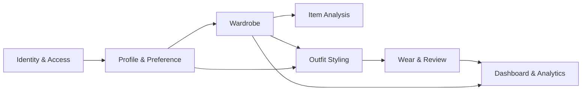
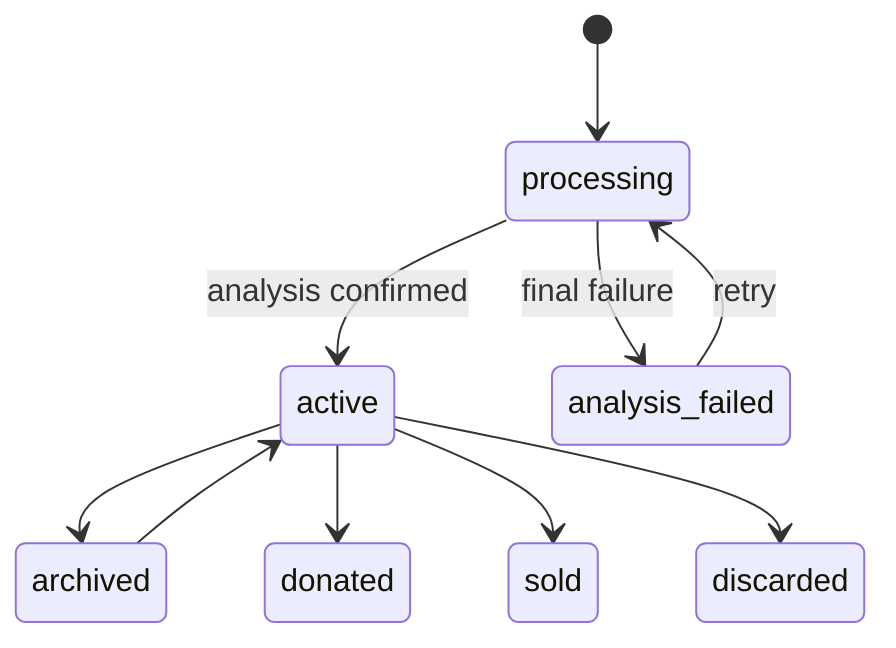
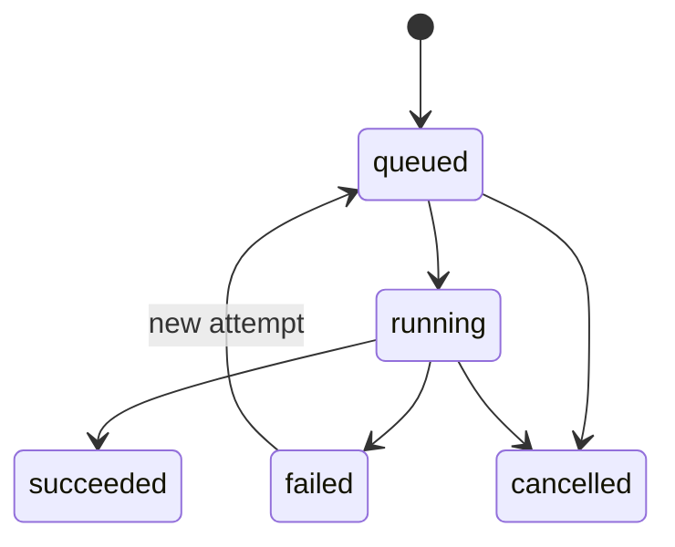

# 도메인 모델

## 1. Bounded Context



| Context | 책임 |
|---|---|
| Identity & Access | 계정, identity, session, OAuth |
| Profile & Preference | 온보딩, 체형, personal colors, 취향/AI 설정 |
| Wardrobe | closet, item, image, lifecycle |
| Item Analysis | 분석 job, AI 원본, 사용자 보정 |
| Outfit Styling | 다중 item outfit, 추천 context, 점수와 설명 |
| Wear & Review | 실제 착용, 별점, quick tags, 노트 |
| Dashboard & Analytics | 옷장 점수, 분포, 활용률, cost per wear |

## 2. Aggregate와 Entity

### User aggregate

```text
User
├── AuthIdentity[]
├── RefreshSession[]
├── UserProfile
└── UserPreference
```

- `User`는 서비스 내부의 안정적인 계정 ID다.
- `AuthIdentity`는 local/apple/google/kakao 같은 로그인 방법이다.
- provider email이 같다는 이유만으로 identity를 자동 연결하지 않는다.
- `UserProfile`은 온보딩과 화면 표시 정보, `UserPreference`는 추천 설정을 가진다.

### Closet aggregate

```text
Closet
└── FashionItem[]
    ├── ItemImage[]
    ├── AnalysisJob[]
    └── ItemAnalysis[]
```

- `FashionItem`은 사용자가 확인한 현재 의류 상태다.
- AI가 반환한 원본은 `ItemAnalysis`, 표시·검색에 쓰는 확정값은 `FashionItem`에 둔다.
- `ItemImage`는 original/mask/transparent/normalized/thumbnail을 구분한다.
- `AnalysisJob`은 실행 상태이지 분석 결과 자체가 아니다.

### Outfit aggregate

```text
Outfit
├── OutfitItem[]
├── OutfitFeedback[]
└── WearEvent[]
    └── OutfitReview?
```

- `Outfit`은 두 개 이상의 item을 역할과 함께 묶은 코디다.
- 추천 context와 점수, 이유는 생성 당시 snapshot으로 저장한다.
- `WearEvent`는 추천 조회가 아니라 실제 착용을 의미한다.
- 리뷰는 특정 착용 경험에 연결한다.

## 3. 핵심 Value Object

### BodyProfile

- `gender_identity`
- `height_cm`
- `body_type`: straight/wave/natural
- `personal_colors`: 계절별 선택 팔레트

값의 의미와 허용 목록은 제품 결정 후 API enum으로 고정한다.

### ItemColor

- `display_hex`: UI 표시용
- `color_name`: 검색/설명용
- `lab` 또는 `lch`: 거리 계산용
- `ratio`: mask 내 점유 비율
- `confidence`

### RecommendationContext

- `date`
- `timezone`
- `occasion`
- `weather_snapshot`
- `preference_snapshot`

날씨와 취향이 바뀌어도 과거 추천 이유를 설명할 수 있도록 snapshot을 사용한다.

### ScoreBreakdown

- `overall`
- `color`
- `season`
- `style`
- `category`
- 추후 `weather`, `occasion`, `comfort`
- `scoring_version`

LLM이 authoritative score를 생성하지 않는다.

## 4. 상태 모델

### FashionItem lifecycle



분석 실행 상태와 의류 lifecycle을 하나의 `status`로 섞지 않는다. 현재 `processing/ready/failed`
필드는 migration 과정에서 `analysis_status`와 `lifecycle_status`로 분리한다.

### AnalysisJob



### Subscription

```text
trialing → active → past_due → cancelled/expired
```

실제 상태 전이는 선택한 결제 provider 의미와 맞춰 확정한다.

## 5. 불변식

1. Closet, item, outfit, wear event는 소유 사용자만 접근한다.
2. 한 outfit에 동일 item을 중복 포함하지 않는다.
3. outfit은 최소 2개의 active item을 가진다.
4. review rating은 1~5이며 wear event당 review는 최대 하나다.
5. like와 dislike는 동일 사용자/outfit에 동시에 존재할 수 없다.
6. wear event의 idempotency key는 사용자 범위에서 유일하다.
7. item의 사용자 확정값 수정이 과거 AI 원본을 변경하지 않는다.
8. succeeded analysis job은 정확히 하나의 결과를 가리킨다.
9. donated/sold/discarded item은 기본 추천 후보에서 제외한다.
10. cost per wear는 가격 없음과 0회 착용을 숫자 0으로 왜곡하지 않는다.

## 6. Domain Service

| Service | 역할 |
|---|---|
| ItemAnalysisService | 업로드 artifact와 Core pipeline 조정 |
| OutfitCandidateGenerator | 역할별 후보와 hard constraint 적용 |
| OutfitScoringService | deterministic score와 breakdown 계산 |
| ExplanationService | 구조화된 사실을 사용자 문장으로 변환 |
| WardrobeScoreService | 버전 있는 옷장 점수 계산 |
| WardrobeAnalyticsService | wear event 기반 기간 집계 |

## 7. Domain Event

비동기 처리와 집계 갱신을 위해 다음 event를 사용할 수 있다.

- `ItemUploaded`
- `ItemAnalysisRequested`
- `ItemAnalysisSucceeded`
- `ItemAnalysisFailed`
- `ItemConfirmed`
- `OutfitRecommended`
- `OutfitWorn`
- `OutfitReviewed`
- `ItemLifecycleChanged`

초기 구현에서는 DB transaction과 job queue만 사용해도 되지만, event 이름과 payload 의미는
application 계층에서 일관되게 유지한다.

## 8. Core와 API 경계

`cloth-vision-core`에 둘 것:

- provider-neutral image/analysis value object
- 이미지 검증·정규화·색상 추출
- matching/scoring과 이유의 구조화 결과
- Vision/segmentation/explanation protocol

`cloth-vision`에 둘 것:

- User/Profile/Closet/Outfit/Wear/Subscription
- SQLAlchemy와 migration
- FastAPI request/response
- JWT/OAuth, storage, queue, weather/payment adapter
- 사용자 소유권과 transaction
