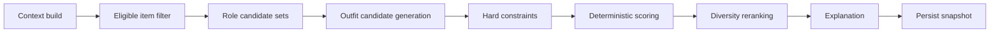

# 코디 추천 설계

## 1. 목표

와이어프레임의 추천은 아이템 두 개의 유사도 목록이 아니라 다음을 만족하는 하나 이상의
완성된 outfit이다.

- 상의·하의·아우터·신발·액세서리 중 필요한 역할 구성
- 날씨, 날짜, 일정/occasion 반영
- 사용자 체형과 취향 반영
- 종합 점수와 color/style/season/comfort 등 근거
- bookmark, like/dislike, 오늘 입기
- 착용 리뷰를 다음 추천에 활용

## 2. 현재 구현

현재 `MatchingEngine`은 source item과 target item을 비교한다.

- color score
- season score
- style score
- category score
- weighted overall score
- deterministic reasons

현재 API는 기준 item의 모든 후보를 pairwise 비교해 정렬할 뿐 outfit을 만들거나 저장하지
않는다. 날씨·occasion·profile·feedback도 사용하지 않는다.

## 3. 추천 단계



### 3.1 Context build

입력:

- user profile/preferences
- closet ID
- date/timezone
- weather snapshot
- occasion
- excluded items
- 최근 wear/feedback

명시적인 사용자 입력이 provider 추론보다 우선한다. 날씨 조회 실패 시 context 일부를
생략한 fallback을 허용하고 응답에 이를 표시한다.

### 3.2 Eligible item filter

기본 제외:

- processing/analysis_failed
- donated/sold/discarded/archived
- 사용자가 명시적으로 제외
- 계절/날씨의 안전 기준에 명백히 위배

세탁 중 같은 availability가 제품 범위에 들어오면 lifecycle과 별도 상태로 추가한다.

### 3.3 Candidate generation

occasion과 날씨에 필요한 role template을 먼저 정한다.

예:

```text
warm office: top + bottom + shoes + optional accessory
cool office: top + bottom + outer + shoes
casual rain: top + bottom + rain-compatible outer + shoes
```

모든 조합을 brute force하지 않고 역할별 상위 후보를 뽑아 beam search 또는 제한된 Cartesian
product로 outfit 후보를 만든다.

### 3.4 Hard constraints

- outfit 최소 2개 item
- 동일 item 중복 금지
- 필수 역할 충족
- lifecycle/availability 충족
- 명시적 비선호와 안전/날씨 제약

hard constraint를 점수로만 약하게 처리하지 않는다.

## 4. 점수 모델

초기 예시:

```text
overall =
    color_compatibility * w_color
  + style_compatibility * w_style
  + season_weather_fit * w_weather
  + occasion_fit * w_occasion
  + preference_fit * w_preference
  + wardrobe_utilization * w_utilization
```

각 component는 0~100 범위로 정규화하고 weight 합은 1이다. 모든 결과에
`scoring_version`을 저장한다.

### Color

- pairwise 색상 조화를 outfit 전체로 aggregate
- 무채색 처리와 사용자 personal color/선호는 별도 factor
- 화면 HEX가 아니라 LAB/LCh 등 비교용 값을 활용

### Style

- 공유 style tag
- 설정된 tag correlation
- occasion dress code

### Season과 Weather

- item season tag
- 기온/체감온도/강수
- layer 구성
- 리뷰의 `too_hot`, `too_cold` 신호

### Comfort

초기에는 검증 가능한 속성만 사용한다. 소재/fit 데이터가 불충분하면 높은 정밀도의 숫자를
만들지 말고 `not_available` 또는 낮은 confidence를 반환한다.

### Utilization

- 최근 덜 입은 active item에 제한된 bonus
- 미착용 item을 무조건 추천해 조합 품질을 훼손하지 않도록 상한 적용

## 5. 응답과 설명

```json
{
  "outfit_id": "uuid",
  "items": [
    {"item_id": "uuid", "role": "outer"},
    {"item_id": "uuid", "role": "top"},
    {"item_id": "uuid", "role": "bottom"},
    {"item_id": "uuid", "role": "shoes"}
  ],
  "overall_score": 95,
  "score_breakdown": {
    "color": 92,
    "style": 98,
    "weather": 96,
    "occasion": 94
  },
  "reasons": [
    "18°C 사무실 회의에 적합한 레이어 구성입니다."
  ],
  "scoring_version": "outfit-v1"
}
```

규칙 엔진이 score와 reason facts를 만든다. LLM은 facts를 자연스러운 스타일 팁으로 바꿀
수 있지만 숫자·아이템·날씨 사실을 추가하거나 변경할 수 없다.

LLM 실패 시 reasons를 그대로 반환한다.

## 6. 피드백과 학습

신호 강도:

1. 실제 wear event
2. review의 rating/quick tags
3. like/dislike
4. bookmark
5. 단순 조회

초기에는 명시적 규칙으로 반영한다.

- `too_hot`: 유사 기온에서 보온 조합 감점
- `too_cold`: layer/outer 없는 조합 감점
- `wear_again`과 높은 rating: 유사 조합 가점
- dislike: 동일 outfit 반복 방지와 reason tag 기반 감점

사용자별 데이터가 적을 때 과적합하지 않도록 global rule과 개인 신호의 weight를 제한한다.

## 7. 다양성과 반복 방지

- 최근 N일 동일 outfit 반복 제한
- 한 item만 계속 추천되지 않도록 exposure cap
- 점수가 비슷하면 덜 입은 item 또는 새로운 조합 우선
- 다양성 reranking이 hard constraint나 큰 품질 차이를 뒤집지 않도록 한계 설정

## 8. Cold Start와 Fallback

| 상황 | 동작 |
|---|---|
| item 부족 | 필요한 역할과 부족 아이템 안내 |
| profile 없음 | 일반 규칙 사용, profile 설정 유도 |
| 날씨 실패 | 계절/occasion 기반 추천과 weather unavailable 표시 |
| 분석값 부족 | category 중심 조합, 낮은 confidence 표시 |
| 추천 후보 없음 | 제약 완화 여부를 명시하고 사용자 선택 요청 |

## 9. 평가

오프라인:

- hard constraint 위반율 0%
- 동일 입력/버전에서 deterministic 결과
- fixture별 expected ranking
- score 범위와 weight 합 invariant
- category/occasion/weather edge case

온라인:

- recommendation → wear 전환율
- like/dislike와 rating
- wear_again tag 비율
- 반복 추천률
- 추천 생성 latency와 실패율

## 10. 저장 데이터

Outfit에 생성 당시 다음을 snapshot으로 저장한다.

- item IDs와 역할
- weather/occasion/preference context
- overall과 breakdown
- reasons와 stylist tip
- scoring version
- 생성 source와 시각

과거 outfit의 점수를 현재 규칙으로 조용히 재계산해 덮어쓰지 않는다.
